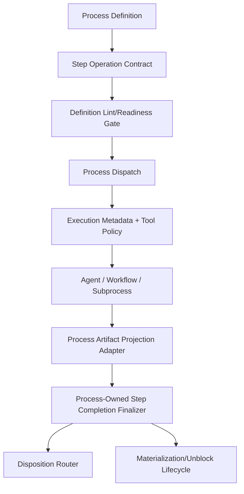

# Target Runtime Architecture

## Core Idea

The next hardening step should move from inferred process semantics to explicit runtime contracts.



## Proposed Production Concepts

### ProcessStepOperationContract

A persisted or derived model attached to each process step.

Suggested fields:

```csharp
public sealed record ProcessStepOperationContract(
    IReadOnlySet<ProcessStepOperation> AllowedOperations,
    ProcessStepTargetScope TargetScope,
    ProcessArtifactExpectationPolicy ArtifactPolicy,
    ProcessDispositionPolicy DispositionPolicy,
    ProcessRetryPolicy RetryPolicy,
    bool IsExplicit);
```

### ProcessStepOperation

Generic operation classes:

- `ReadProcessContext`
- `ReadProjectStructure`
- `ReadUpstreamArtifacts`
- `WriteManagedProcessArtifacts`
- `WriteExternalArtifactDestination`
- `MutateProductTarget`
- `RunValidation`
- `LaunchRuntime`
- `CaptureRuntimeProof`
- `ExecuteExternalAction`
- `RecoverArtifactsOnly`
- `EscalateOrDecide`

### ProcessTargetScope

- `ManagedProcessArtifactsOnly`
- `ManagedOutputProduct`
- `ExternalArtifactDestination`
- `ExternalProductTargetReadOnly`
- `ExternalProductTargetMutable`
- `ExternalActionControlled`

### ProcessDispositionPolicy

- `ArtifactProductionMustBlockOnMissingOwnArtifacts`
- `ReviewCanRouteToRepairOrNoGo`
- `ApprovalCanRouteToApprovedRejectedEscalated`
- `EscalationCanCompleteWithNoGoDecision`
- `NoNegativeRoutingForMissingInputs`

## Boundary Classification

The existing `ResolveProcessStepExecutionBoundary` should become a fallback classifier only. It should produce:

- suggested contract
- confidence score
- lint issue when confidence is low
- never override explicit contract

## Tool Policy

Tool policy must evaluate:

- operation class requested
- path class requested
- current step operation contract
- process boundary metadata
- read-only aliases
- writable aliases
- managed output product paths
- process artifact paths

## Artifact Projection Adapters

Add explicit adapters:

- `DirectAgentArtifactProjectionAdapter`
- `WorkflowProcessArtifactProjectionAdapter`
- `SubprocessParentArtifactProjectionAdapter`
- `ManagerRecoveryArtifactProjectionAdapter`
- `ManualArtifactProjectionAdapter`

Each adapter produces records with typed provenance.
