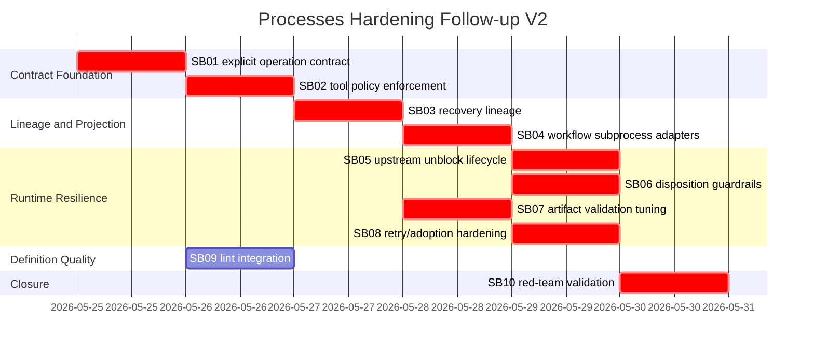

# Phase Plan

## Execution Order

1. `01-explicit-step-operation-contract-and-classifier-hardening`
2. `02-tool-policy-boundary-enforcement-and-metadata-no-autopromotion`
3. `03-manager-recovery-lineage-and-recovery-artifact-validation`
4. `04-workflow-subprocess-artifact-adapters-and-parent-versioning`
5. `05-upstream-materialization-unblock-and-resume-lifecycle`
6. `06-disposition-routing-guardrails`
7. `07-storage-backed-artifact-validation-and-explicit-modes`
8. `08-no-progress-retry-and-active-run-adoption-hardening`
9. `09-process-definition-lint-integration-and-template-quality-gates`
10. `10-generic-red-team-validation-suite`

Execution result: all phases completed in the planned order, with SB09 completed before final SB10 red-team closure.
## Subbundle Dependency Map



## Critical Subbundles

- SB01 is critical because operation boundaries must be explicit before tool enforcement.
- SB02 is critical because metadata must not auto-promote read-only targets.
- SB03 is critical because recovery artifacts must carry valid recovery lineage.
- SB04 is critical because workflow/subprocess outputs must be typed before finalizer validation.
- SB05 is critical because missing upstream materialization must unblock downstream steps.
- SB06 is critical because branch routing must not mask missing artifact production.
- SB07 is critical because artifact validation must use storage-backed content and explicit modes.
- SB08 is critical because no-progress retries and active execution adoption affect runtime correctness.
- SB10 is critical because generic red-team validation proves software and non-software behavior.
- SB09 is required before closure and may run after urgent runtime fixes.

## Phase Gates

### Prepared Gate

Run after placing this bundle in the repo:

```powershell
python codex/skills/bundles/candoitall-bundle-preparation/scripts/validate_bundle.py --stage prepared codex/bundles/processes-hardening-followup-runtime-resilience-v2
```

Also run the repository bundle validator if available:

```powershell
# Use the CanDoItAll bundle validator skill/tool if installed.
```

### Per-Subbundle Closure Gate

Each subbundle must provide:

- source assertions
- failing-first or red-team proof
- passing proof
- anti-stub audit
- changed-file hashes
- focused tests
- build proof when production code changed
- PostgreSQL-only confirmation when data model changes are introduced

### Final Closure Gate

Run:

```powershell
dotnet test tests/CanDoItAll.Tests.Integration/CanDoItAll.Tests.Integration.csproj --no-restore --filter "FullyQualifiedName~ProcessRunAutomationDispatchServiceTests|FullyQualifiedName~ProcessDefinitionLinterTests"
dotnet test tests/CanDoItAll.Tests.Unit/CanDoItAll.Tests.Unit.csproj --no-restore
dotnet build CanDoItAll.slnx --no-restore
rg -n "Sqlite|SQLite|UseSqlite|Migrations.Sqlite" src tests codex/bundles/processes-hardening-followup-runtime-resilience-v2 -S
```

If UI start/publish surfaces are changed by SB09, add component/browser proof for the lint panel and process start warning.

