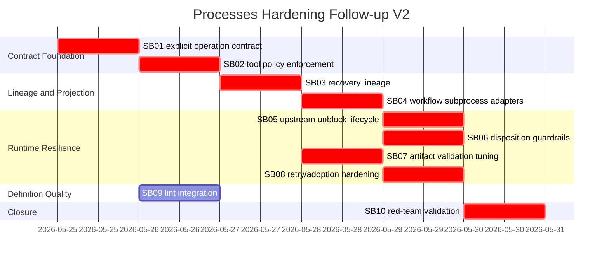

# Phase Plan

## Subbundle Dependency Map



## Critical Subbundles

All subbundles are critical except SB09 can be executed slightly later if runtime fixes are urgent. SB09 is still required before closure.

## Phase Gates

### Prepared Gate

Run after placing this bundle in the repo:

```powershell
python codex/skills/bundles/candoitall-bundle-preparation/scripts/validate_bundle.py --stage prepared codex/bundles/processes-hardening-followup-runtime-resilience-v2
```

Also run the repository bundle validator if available:

```powershell
# Use the CanDoItAll bundle validator skill/tool if installed.
```

### Per-Subbundle Closure Gate

Each subbundle must provide:

- source assertions
- failing-first or red-team proof
- passing proof
- anti-stub audit
- changed-file hashes
- focused tests
- build proof when production code changed
- PostgreSQL-only confirmation when data model changes are introduced

### Final Closure Gate

Run:

```powershell
dotnet test tests/CanDoItAll.Tests.Integration/CanDoItAll.Tests.Integration.csproj --no-restore --filter "FullyQualifiedName~ProcessRunAutomationDispatchServiceTests|FullyQualifiedName~ProcessDefinitionLinterTests"
dotnet test tests/CanDoItAll.Tests.Unit/CanDoItAll.Tests.Unit.csproj --no-restore
dotnet build CanDoItAll.slnx --no-restore
rg -n "Sqlite|SQLite|UseSqlite|Migrations.Sqlite" src tests codex/bundles/processes-hardening-followup-runtime-resilience-v2 -S
```

If UI start/publish surfaces are changed by SB09, add component/browser proof for the lint panel and process start warning.
