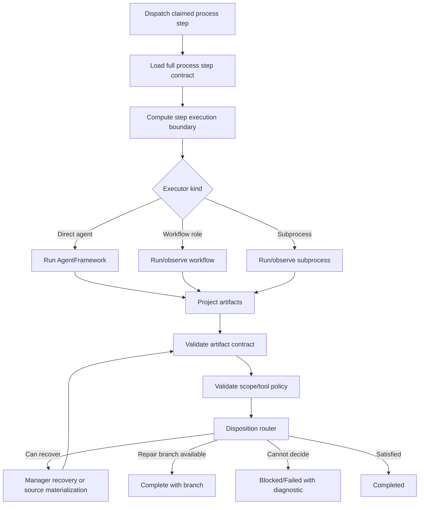

# Target Solution

## Concept

Introduce a stronger process runtime contract made of four cooperating layers:

1. `ProcessStepExecutionBoundary`
2. `ProcessArtifactContractValidator`
3. `ProcessDispositionRouter`
4. `ProcessResumeAndNoProgressController`

These layers stay generic and do not encode Blazor, .NET, JavaScript, or software-development assumptions.

## Layer 1: ProcessStepExecutionBoundary

A generic boundary computed from explicit step definition fields and conservative inference fallback.

Example operations:

```text
ReadProcessContext
ReadUpstreamArtifacts
WriteManagedArtifacts
MutateDeclaredTarget
RunValidation
LaunchRuntime
CaptureBrowserProof
PerformExternalAction
RecoverArtifactsOnly
```

Every process step gets:

```text
AllowedOperations
DeniedOperations
ArtifactWriteRoots
ProductMutationRoots
ReadOnlyRoots
RequiredToolFamilies
ScopeViolationAction
```

## Layer 2: ProcessArtifactContractValidator

Validates artifact contracts after projection using explicit mode where available and conservative fallback where not.

Modes:

```text
Narrative
Decision
Evidence
Deliverable
RuntimeProof
RecoveryDiagnostic
```

But runtime must avoid aggressive string-only classification. Prefer explicit fields or a normalized artifact contract object.

## Layer 3: ProcessDispositionRouter

Turns finalizer observations into a process state transition:

```text
Completed
Completed + BranchOutcome(repair/rework/no-go/escalate)
Blocked
Failed
WaitingApproval
Refused
```

It should not hard-block a review/decision step if the step can make a governed negative disposition and select a branch.

## Layer 4: ProcessResumeAndNoProgressController

Coordinates:

- upstream artifact materialization,
- blocked/waiting dependent step reactivation,
- repeated failure fingerprints,
- manager recovery vs executor rerun,
- escalation when recovery cannot improve state.

## Runtime Flow


