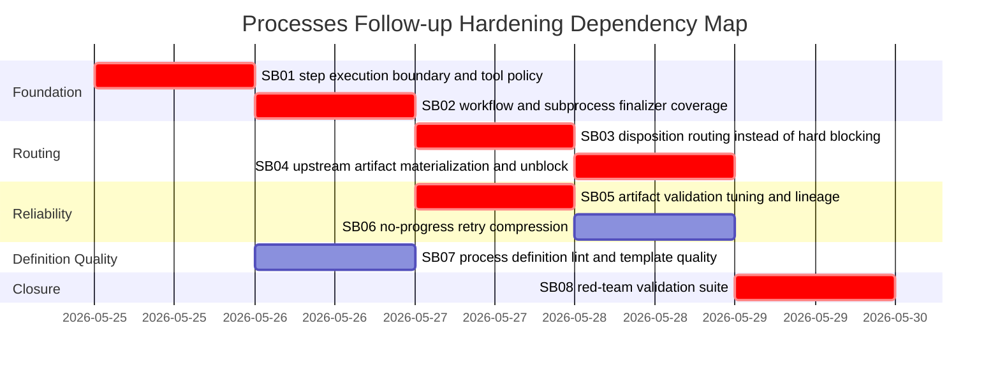

# Phase Plan

## Subbundle Dependency Map



## Critical Subbundles

- `SB01` is critical because scope boundaries must be enforced before more retry/recovery logic is added.
- `SB02` is critical because workflow/subprocess paths still have weaker artifact validation.
- `SB03` is critical because hard blocking must be replaced by governed branch disposition where possible.
- `SB04` is critical because missing upstream artifacts can strand downstream steps.
- `SB05` is critical because overly heuristic validation can create false blocks across generic process types.
- `SB08` is critical because the user reported real process drift and blocking; red-team proof is required.

## Phase Gates

### Prepared bundle gate

Run:

```powershell
python codex/skills/bundles/candoitall-bundle-preparation/scripts/validate_bundle.py --stage prepared codex/bundles/processes-hardening-followup-scope-resilience
```

### SB01 gate

Must prove a non-mutating architecture/design step cannot mutate product/external-target files even if the agent attempts to call write/scaffold tools.

### SB02 gate

Must prove workflow-backed and subprocess-backed process steps load expected artifacts and run through process-owned finalizer validation.

### SB03 gate

Must prove a review step with a repair branch completes with that branch rather than `Blocked` when product defects are found.

### SB04 gate

Must prove a downstream step blocked/waiting on upstream artifact resumes after the upstream artifact is produced.

### SB05 gate

Must prove generic artifacts with `TODO`, `not available`, `decision log`, and `.json` invalid content are handled correctly.

### SB06 gate

Must prove repeated same-fingerprint failures stop before max retries unless a new evidence/mutation signal appears.

### SB07 gate

Must prove process definition lint catches the Blazor architecture-step-over-implementation template defect and at least two non-software definition defects.

### SB08 final gate

Must run the red-team suite and full relevant integration tests; record transcripts and changed-file hashes.
