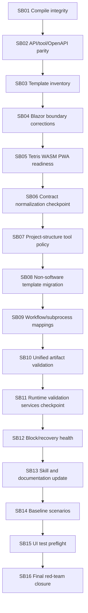

# Phase Plan

## Execution Order

1. SB01 compile/build integrity.
2. SB02 API/tool/OpenAPI parity.
3. SB03 template inventory matrix.
4. SB04 Blazor template boundary corrections.
5. SB05 Tetris WASM PWA readiness.
6. SB06 refactor checkpoint A.
7. SB07 project-structure tool policy.
8. SB08 non-software template migration.
9. SB09 workflow/subprocess output mapping hardening.
10. SB10 unified artifact validation for API transitions.
11. SB11 refactor checkpoint B.
12. SB12 block/recovery health readiness.
13. SB13 process skill and documentation update.
14. SB14 baseline scenarios and seed pack.
15. SB15 UI test preflight.
16. SB16 final red-team and closure.

## Subbundle Dependency Map



## Critical Subbundles

- SB01 is a critical foundation because downstream proof is meaningless when the solution cannot build.
- SB04 is a critical foundation because Blazor template mutation boundaries gate the planned Tetris process run.
- SB06 is a critical foundation because operation contract normalization is reused by editor save, import/export, template projection, lint, dispatch metadata, and tests.
- SB07 is a critical foundation because project-structure mutation must be governed before writeback templates can be trusted.
- SB10 is a critical foundation because manual/API step completion must not bypass finalizer-grade artifact validation.
- SB15 is a critical foundation for browser/UI readiness because it defines the proof surface for the upcoming Tetris run.
- SB16 is critical final verification and red-team closure.

## Phase Gates

- SB01 gate: build and enum/default proof pass before API/tool parity work starts.
- SB04 gate: manifest-driven Blazor template audit and negative mutation tests pass before Tetris template readiness starts.
- SB06 gate: one authoritative operation-contract normalizer is used by all named surfaces before project-structure policy work starts.
- SB07 gate: project-structure mutation tools are classified and rejected for read-only contracts before non-software template migration starts.
- SB10 gate: API/manual transition tests reject weak required artifacts through the shared validator before runtime service refactoring starts.
- SB15 gate: UI preflight evidence, diagnostics surfaces, and browser-proof expectations are documented before final red-team closure starts.

## Minimum Validation Commands

```powershell
dotnet build CanDoItAll.slnx --no-restore
dotnet test tests/CanDoItAll.Tests.Unit/CanDoItAll.Tests.Unit.csproj --no-restore --filter "FullyQualifiedName~AgentToolInvocationPolicyTests"
dotnet test tests/CanDoItAll.Tests.Integration/CanDoItAll.Tests.Integration.csproj --no-restore --filter "FullyQualifiedName~ProcessRunAutomationDispatchServiceTests|FullyQualifiedName~ProcessesServiceIntegrationTests|FullyQualifiedName~ProcessDefinitionLinterTests|FullyQualifiedName~ApiIntegrationTests"
dotnet test tests/CanDoItAll.Tests.Components/CanDoItAll.Tests.Components.csproj --no-restore --filter "FullyQualifiedName~ProcessStepEditorFormTests"
rg -n "Sqlite|SQLite|UseSqlite|Migrations.Sqlite" src tests Templates codex -S
```

## Template-Specific Audit Commands

```powershell
rg -n '"AllowedOperations"|"OperationTargetScope"' Templates/Processes/processes -S
rg -n '"MutateProductTarget"|"ExternalProductTargetMutable"' Templates/Processes/processes/blazor-* -S
rg -n 'project_structure_asset_create|project_structure_node_create|project_structure_' src Templates codex -S
```
