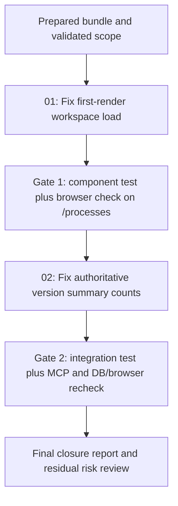

# Phase Plan

## Phase Sequence

1. Prepare the bundle and confirm the defect model from the existing repro.
2. Fix the global workspace first-load path because downstream browser validation is meaningless until the page can see persisted definitions.
3. Fix summary-version counting and lock it with a focused integration test.
4. Run component and integration tests, build the affected projects, and repeat MCP plus browser verification.
5. Record closure evidence and residual risks in the execution report.

## Subbundle Dependency Map

## Critical Subbundles

- `subbundles/01-global-processes-page-initial-load-and-profile-coherent-visibility` is the foundation subbundle. If it is not closed with browser proof, the workspace cannot be trusted for any follow-on validation.
- `subbundles/02-definition-summary-counts-and-verification-closure` depends on subbundle 01 because the visible summary counts are only meaningful once the page reliably loads the active profile data.

## Phase Gates

- Gate after preparation: run the bundle validator and repair any documentation failures before code changes.
- Gate after subbundle 01: the component test must pass and `/processes` must show persisted definitions on the first browser visit with no query string.
- Gate after subbundle 02: counts must remain stable after publish clones a new draft, as proven by integration assertions and visible browser output.
- Gate before closure: rerun the targeted tests, build the affected solution slice, and update the execution report with concrete MCP, DB, and browser evidence.
