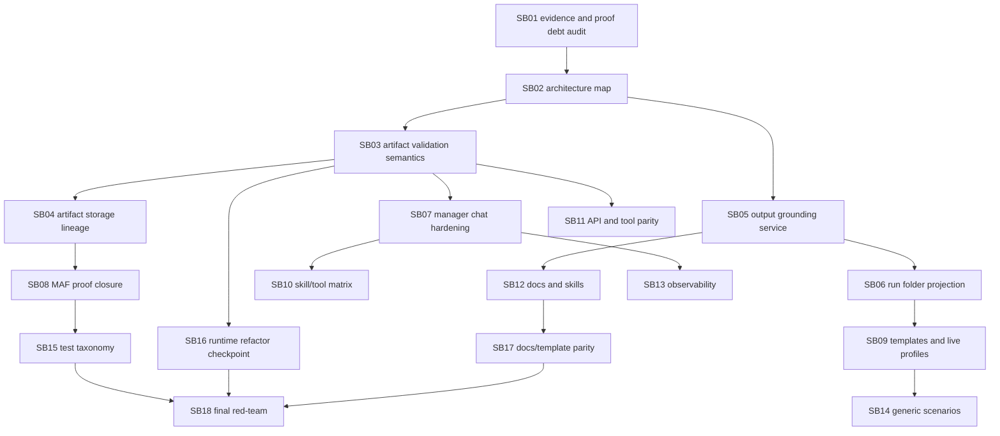

# Phase Plan

## Execution Order

1. Audit current successful live run and proof debt.
2. Map architecture and refactor boundaries.
3. Harden artifact validation/status/read-model semantics.
4. Harden artifact storage/lineage/dedupe/retention.
5. Refactor output grounding/final delivery.
6. Harden project-structure folder projection.
7. Harden manager chat.
8. Close MAF/tool/skill proof debt.
9. Update templates/live-run profiles.
10. Build skill/tool matrix.
11. Update API/tool parity.
12. Update docs/skills.
13. Improve observability.
14. Protect generic process scenarios.
15. Refactor test taxonomy and proof harness.
16. Runtime service refactor checkpoint.
17. Docs/template parity checkpoint.
18. Final red-team and release readiness.

## Subbundle Dependency Map



## Critical Subbundles

- SB01 is critical because later closure relies on accurate proof-debt classification.
- SB03 is critical because artifact status semantics feed health, recovery, API, UI, and final readiness.
- SB04 is critical because storage identity, hash, dedupe, and stale-record precedence protect recovery proof.
- SB05 is critical because final delivery proof must be grounded in generic project-structure targets.
- SB06 is critical because project-structure run projection is the operator-visible handoff surface.
- SB07 is critical because manager chat and run inspection drive recovery and approvals.
- SB10 is critical because agent skill/tool gating prevents improvisation.
- SB15 is critical because final closure depends on durable, non-timeout proof categories.
- SB18 is critical because it red-teams the whole release-readiness claim.

## Phase Gates

- SB01 must pass before any runtime code changes; otherwise proof debt can be misclassified.
- SB02 must pass before service extraction; otherwise refactors may duplicate or invert ownership.
- SB03-SB07 must pass before API, docs, observability, and generic scenario work relies on runtime semantics.
- SB08 and SB15 must split timeout-prone proof before final release-readiness validation.
- SB16 must pass after runtime refactors and before final red-team.
- SB17 must pass before SB18 so final release readiness checks current docs/templates/skills.
- SB18 may mark unresolved items only as explicit blockers or follow-up work, never as hidden residual risk.

## Required command groups

```powershell
dotnet restore CanDoItAll.slnx
dotnet build CanDoItAll.slnx --no-restore
dotnet test tests/CanDoItAll.Tests.Unit/CanDoItAll.Tests.Unit.csproj --no-restore --filter "FullyQualifiedName~Process|FullyQualifiedName~Maf|FullyQualifiedName~Agent|FullyQualifiedName~Tool"
dotnet test tests/CanDoItAll.Tests.Integration/CanDoItAll.Tests.Integration.csproj --no-restore --filter "FullyQualifiedName~ProcessRunAutomationDispatchServiceTests|FullyQualifiedName~ProcessesServiceIntegrationTests|FullyQualifiedName~ProjectWorkbenchServiceIntegrationTests|FullyQualifiedName~ProcessTemplateGovernanceTests|FullyQualifiedName~ApiIntegrationTests"
dotnet test tests/CanDoItAll.Tests.Components/CanDoItAll.Tests.Components.csproj --no-restore --filter "FullyQualifiedName~Process"
rg -n "Sqlite|SQLite|UseSqlite|Migrations.Sqlite" src tests Templates codex -S
```

## Proof strategy

Do not rely on a single broad timeout-prone command. Split into named suites:

- artifact validation status matrix
- artifact storage/lineage/dedupe
- output grounding
- manager chat resolver
- project-structure projection
- process API/tool surface
- template pack governance
- MAF/tool policy
- live-run smoke
