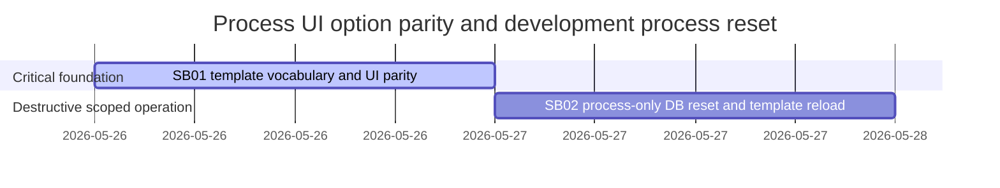

# Phase Plan

## Phase Sequence

1. Prepared gate: validate this bundle before implementation.
2. SB01: add typed vocabulary and UI option parity, then run focused component/integration tests.
3. SB02: after SB01 passes, clear process-owned data in the development database and reload current process templates.
4. Final closure: validate tests, build, proof manifests, raw-note closure, and completed-stage bundle gate.

## Subbundle Dependency Map

- SB02 depends on SB01 because the reloaded templates must not immediately lose unsupported vocabulary.

## Critical Subbundles

- SB01 is a critical foundation. It requires semantic proof that template vocabulary maps to UI/domain options without fallback and that missing values are not merely rendered as text.
- SB02 is destructive operational work. It requires command transcripts, before/after counts, and preservation proof for non-process data.

## Phase Gates

- Gate after preparation: run `validate_bundle.py --stage prepared` and repair failures.
- Gate before SB01: source references and template vocabulary inventory must still match the repo.
- Gate after SB01: focused tests pass, anti-stub audit passes, and no unsupported template vocabulary remains for owned fields.
- Gate before SB02: SB01 status is `Completed`, build/test proof is recorded, and SQL target list contains only `Processes_` tables.
- Gate after SB02: before/after database proof shows process data reset, non-process representative data preserved, and template definitions reloaded.
- Gate before closure: run `validate_bundle.py --stage completed`, close raw notes, and record any validation gap explicitly.
