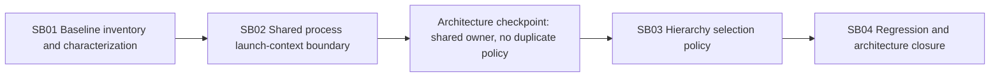

# Phase Plan

## Phase Sequence

1. `SB01` freezes current ownership, invariants, baseline metrics, and available characterization proof.
2. `SB02` extracts the shared process launch-context builder and closes its Behavioral gate.
3. `SB03` extracts hierarchy selection policy only after SB02 proves the local extraction pattern.
4. `SB04` runs affected regression, architecture review, and final bundle closure.

## Subbundle Dependency Map

## Critical Subbundles

| Subbundle | Tier | Critical | Unlock condition |
| --- | --- | --- | --- |
| `SB01` | Standard | yes | ownership/invariants/available characterization agree with source |
| `SB02` | Behavioral | yes | direct positive/negative/boundary tests pass and both production callers delegate |
| `SB03` | Behavioral | no | hierarchy policy tests and page delegation pass |
| `SB04` | Behavioral | terminal | builds/regressions/source assertions/architecture gate agree |

## Reopen Rules

- A summary/output-root behavior contradiction reopens SB02 and invalidates SB04.
- A hierarchy eligibility contradiction reopens SB03 and invalidates SB04.
- A new project reference, partial class, interface-only wrapper, or mutable page-state extraction repairs the bundle before further work.
- Any unrelated Project Structure regression blocks closure rather than becoming residual-risk prose.

## Phase Gates

- Prepared gate: canonical validator and SB01 entry gate pass.
- SB02 gate: direct Behavioral proof and shared-owner source assertion pass.
- SB03 gate: hierarchy policy Behavioral proof passes.
- Closure gate: affected regression, architecture review, traceability, and completed validator agree.

## UI Policy

No markup, CSS, component composition, overlay, viewport, or scroll ownership changes are in scope. Browser artifacts are therefore not required; rendered component regressions remain required.
