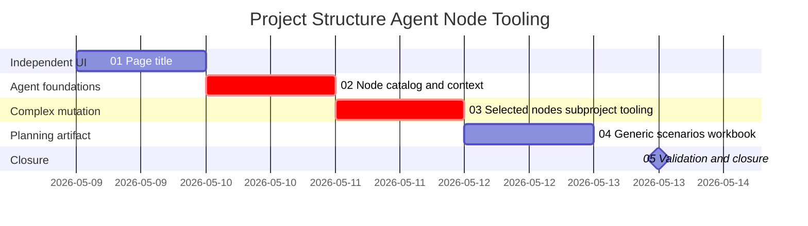

# Phase Plan

## Phase Sequence

1. Complete `01-project-structure-page-title`; this is independent UI chrome.
2. Complete `02-agent-node-catalog-and-context`; this is a critical foundation for agent correctness.
3. Complete `03-selected-node-subproject-tooling`; this depends on selected-node context and service contracts.
4. Complete `04-generic-agent-scenarios-workbook`; use shipped tool names and residual scenario analysis.
5. Complete `05-validation-and-closure`; run targeted tests, update execution report, and close raw notes.

## Subbundle Dependency Map

- The critical path is subbundle 02 before subbundle 03; selected-node tooling should not close without prompt/context support.

## Critical Subbundles

- `02-agent-node-catalog-and-context`: must prove catalog includes `WorkItem/task` and prompt context includes selected node IDs.
- `03-selected-node-subproject-tooling`: must prove moved nodes keep valid target-project parentage and internal dependencies.

## Phase Gates

- Gate after preparation: run `validate_bundle.py --stage prepared`.
- Gate before subbundle 01: confirm `ProjectStructurePage.razor` still owns page title.
- Gate before subbundle 02: confirm MAF tools and contextual component still compile from inspected source references.
- Gate before subbundle 03: confirm subbundle 02 closure proof is strong enough for selected-node context.
- Gate before subbundle 04: confirm shipped/implemented tool names and remaining candidates are known.
- Gate before closure: run targeted tests, verify workbook, close raw notes, and run `validate_bundle.py --stage completed`.
