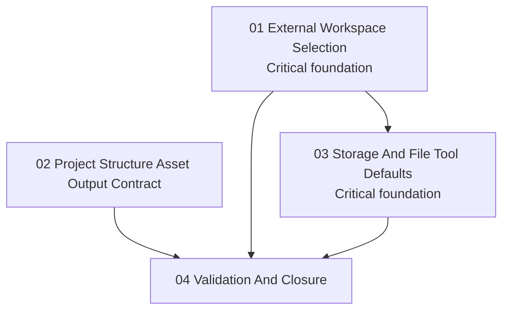

# Phase Plan

## Phase Sequence

1. `01-external-workspace-selection`: add agent settings metadata and runtime guards for selected external workspace aliases.
2. `02-project-structure-asset-output-contract`: harden internal and MCP guidance so Mermaid and file outputs land as typed file nodes.
3. `03-storage-and-file-tool-defaults`: expose storage-driver tools and standard file-tool policy through agent settings.
4. `04-validation-and-closure`: run targeted tests, sync proof, and close the raw notes.

## Subbundle Dependency Map

## Critical Subbundles

- `01-external-workspace-selection`: Critical foundation. Later file and command tool proof depends on alias normalization and external-root guards being correct.
- `03-storage-and-file-tool-defaults`: Critical foundation. Storage tool closure depends on enforceable agent read/write policy and safe driver capability checks.

## Phase Gates

- Preparation gate: run `scripts/validate_bundle.py --stage prepared` and manually audit input coverage.
- Gate after subbundle 01: tests must prove selected external roots round-trip through agent settings and external aliases outside the configured roots are denied.
- Gate after subbundle 02: tests or static assertions must prove both internal and MCP descriptions state the Mermaid/file node contract.
- Gate after subbundle 03: tests must prove storage catalog filtering and read/write denial paths.
- Closure gate: run targeted test suite(s), update `reviews/01-execution-report.md`, close every raw note, and run `scripts/validate_bundle.py --stage completed`.
