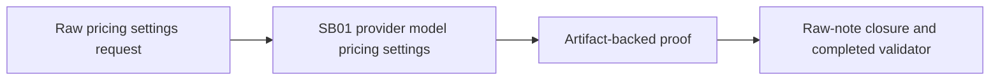

# Phase Plan

## Phase Sequence

1. Run the prepared-stage bundle validator.
2. Execute `SB01` only after the prepared gate passes.
3. Capture unit/build proof, source assertions, changed-file hashes, and raw-note closure in `proof/SB01/`.
4. Run completed-stage validation and update `reviews/01-execution-report.md`.

## Subbundle Dependency Map

- Single-subundle bundle. There are no downstream implementation phases, but closure depends on `SB01` proof quality.

## Critical Subbundles

- `SB01 provider-model-pricing-settings` is a `Critical foundation` because it owns the typed pricing merge contract used by runtime cost calculation and both provider-settings UI surfaces.
- Required deeper validation: semantic positive fixture with explicit API prices, adversarial fixture with model names only, manual-row preservation proof, anti-stub audit, changed-file hashes, and raw-note literal closure.

## Phase Gates

- Gate after preparation: run `python codex/skills/bundles/candoitall-bundle-preparation/scripts/validate_bundle.py --stage prepared codex/bundles/provider-model-pricing-settings-v1` and repair failures.
- Gate before `SB01`: verify the provider pricing editor, workspace service, and provider adapter files still match the current-state analysis.
- Gate after `SB01`: targeted tests/build pass or failures are documented as unrelated; proof manifest and semantic invariants exist under `proof/SB01/`.
- Gate before closure: completed-stage validator passes, execution report closes `N001`-`N005`, and residual browser validation gaps are explicit.
