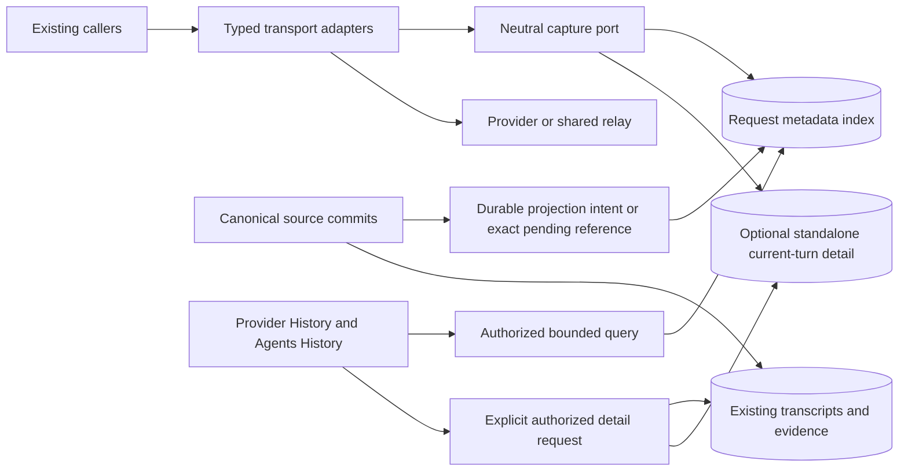

# Target Solution

Status: design for implementation; no feature code has been changed.

## Decisions

1. Reuse existing canonical records. Shared relay audit remains in ProviderManagement;
   agent, simple-chat and workflow records remain with their current owners.
2. Add one compact request metadata index, not another transcript store. Search never
   invokes the all-history usage dashboard or scans agent history files.
3. Provider and model IDs select records; they do not identify an invocation. A logical
   operation, each provider-call attempt, canonical evidence and remote relay observation
   are distinct identities.
4. Use three small projects under `src/MAF/ProviderHistory`: Abstractions, Application,
   Persistence. This isolates producer contracts from query policy and EF/lifecycle code.
   Existing modules supply adapters; the neutral feature does not reference its producers.
5. Capture at actual typed boundaries: MAF SDK client, provider-backed chat/stream,
   batch item, image/voice/model operation, and existing relay audit. No universal
   runtime-handle or driver-factory decorator can cover them all.
6. Store the validated managed credential ID independently from subject. Exact-person
   IDM/EGCP resolution is deferred. A context header, trace ID or provider secret is not
   a client identity.
7. Snapshot pricing before dispatch; compute from supported observed usage, preserve
   unknown/partial evidence, and do not price old requests from today's catalog.
8. Ship one reusable History feature in two scopes: next to provider Sharing, and
   as an Agents tab over all authorized providers in the current instance/profile.
9. No history data is fetched until Search. Server predicates, stable cursor paging,
   cancellation and content authorization are mandatory.
10. Light is the default. Detailed capture for otherwise untracked content is a bounded
    redacted current-turn input and response, not full wire replay.

## Request And Read Flow

Arrows show runtime flow, not project references. See the separate
[dependency contract](02-csharp-dependency-direction.md).

## Data Ownership

| Data | Authority | Additional history storage |
|---|---|---|
| Agent transcript/evidence | Existing agent persistence | Metadata projection and typed owner link only. |
| Simple-chat messages/invocations | Existing conversation/invocation persistence | Metadata projection and links; no copied message text. |
| Workflow/process use of an existing provider observation | Existing observation and lineage | Same attempt plus additional owner link, not another charged call. |
| Publisher relay request | Existing `SharedProviderInvocationRecord` | Search projection; optional bounded detail only because relay currently owns no transcript. |
| Other untracked provider call | New standalone request entry | Its one canonical metadata row and optional detail. |
| Imported-client/publisher relation | Each instance's local record | Optional observed remote request-ID relation; no global billing deduplication. |

The index stores scalar facts needed for filtering and display, source/version references,
and price provenance. It is not the billing authority for tracked calls. It must not be
added as a second `IProviderUsageProjectionSource` over the same observations.

## Explicit Scope And Defaults

- All-provider means all authorized local and imported provider profiles in the active
  instance/database profile/security partition. It does not fetch another server's logs.
- Historical retained canonical records are indexed incrementally, with known gaps shown.
  No fake client IDs, request times, physical attempts or historic prices are invented.
- The proposed 30-day metadata retention applies to standalone/direct and relay audit
  history. Canonical projections follow the original source lifetime, so old retained
  chats/workflows remain searchable in a selected date range.
- Optional history-owned detail (direct or eligible relay) defaults to 7 days and
  32 KiB UTF-8 each for current-turn input and response; the configurable hard policy
  maximum is 128 KiB per field. Omitted prior context, redaction and truncation are explicit.
- Default draft search is the last 24 hours, 50 rows; maximum page size 200 and interval
  31 days. Any retained period may be selected; the range cap is not a history-age cutoff.
- Exact wire replay, content-addressed prompt block storage, external log federation,
  full-text body search, export, chargeback/invoicing and exact IDM person mapping are
  separate work. None is silently implied by the History label.

## Failure Contract

Required audit start must be durable before irreversible provider dispatch. Existing
canonical dispatch evidence may satisfy this if it includes the attempt identity and
a replayable projection intent; otherwise reserve the neutral metadata row first.
If that cannot be recorded, fail explicitly before invoking the provider.

A terminal write failure must never cause a second inference request. Preserve the durable
start, retry persistence under an independent bounded cleanup token, report the audit
failure, and recover as interrupted/usage-unknown when terminal evidence cannot be proven.
Do not rewrite delivered output as a fresh successful attempt. Optional detailed capture
can be omitted for a declared policy/quota/redaction reason while required metadata remains
durable. Storage errors themselves must be logged and surfaced, not swallowed.

## Architectural Constraints

- New history classes normally stay within 250 lines; an exception above 250 needs a
  responsibility review, and above 400 requires a written redesign/exception gate.
  These are review thresholds, not reasons to split one responsibility arbitrarily.
- No new runtime partial, broad history manager, reflected payload classifier,
  service locator, repeated transcript serialization, or new provider-specific dependency
  in neutral contracts.
- Existing large files receive small calls to new top-level collaborators. If behavior
  is moved out, the old body must disappear and direct tests target the new owner.
- No new library or framework version is necessary. Existing .NET 10, EF Core,
  PostgreSQL, component packages and host patterns remain the baseline.

## Official Guidance Checked

The query uses an immutable unique ordering and matching indexes, following
[EF Core pagination guidance](https://learn.microsoft.com/en-us/ef/core/querying/pagination).
Metadata-only projection and bounded result sets follow
[EF Core efficient querying](https://learn.microsoft.com/en-us/ef/core/performance/efficient-querying).

Source changes and projection intents must share a real transaction when they share a
database; separate contexts are not assumed to commit atomically.
[EF Core transactions](https://learn.microsoft.com/en-us/ef/core/saving/transactions).

Authorization is evaluated against the selected resource and operation after identity
validation; UI visibility alone is insufficient.
[ASP.NET Core resource authorization](https://learn.microsoft.com/en-us/aspnet/core/security/authorization/resource-based?view=aspnetcore-10.0).

These sources support the technical choices; the defaults, project split, source ownership
and bounded detail contract are design decisions derived from this repository.
