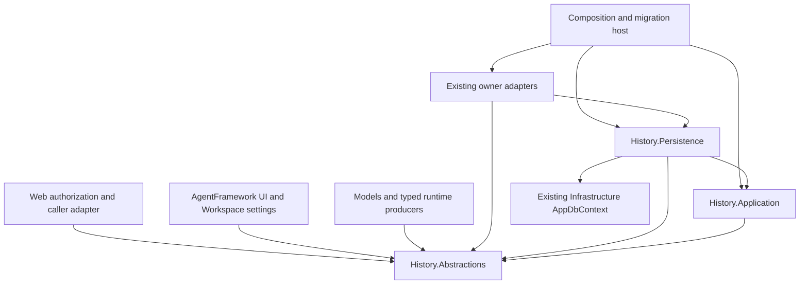

# C# Dependency Direction

## Current Baseline

The [declared graph](../inventories/03-project-reference-inventory.json) covers 104 source
projects and 534 literal references, with no missing paths or project cycles. This is not
an evaluated build graph. Existing ProviderManagement and provider-foundation architecture
tests are release gates; this bundle does not relax them.

## Intended Project References

Arrows mean compile-time dependency, not data flow.

The owner-to-Persistence edge applies only to existing persistence owners that stage
outbox changes in their own DbContext. Runtime producers and UI do not take that edge.

| Project / owner | New references allowed by this design | Reason |
|---|---|---|
| History.Abstractions | None | Stable BCL-only contracts shared by independently evolving producers. |
| History.Application | History.Abstractions | Policy, capture and query orchestration; existing Microsoft.Extensions abstractions only when needed. |
| History.Persistence | History.Abstractions, History.Application, Infrastructure | EF storage, same-context outbox, lifecycle workers and application registration. Existing protection abstraction stays behind its adapter. |
| Models | History.Abstractions | Explicit typed invocation/ownership context and attempt correlation in existing evidence models. No reverse edge. |
| Llm.Abstractions / Llm.ProviderRuntime | History.Abstractions | Typed request context and per-dispatch buffered/stream terminal observation. |
| Maf / Voice / ProviderPipelines and existing runtime adapter owner | History.Abstractions where the new adapter directly consumes its port | Actual SDK/image/voice/batch capture. Add only references used by that owner's new typed code. |
| Providers | History.Abstractions only if its existing typed handle contract directly carries that context | Context propagation only; no dependency on history implementations. Prefer the context already exposed via Models when sufficient. |
| ProviderManagement | History.Abstractions + History.Persistence in its existing audit persistence adapter | Caller/pricing mapping and same-context relay outbox staging. Never Workspace/Web/UI. |
| SimpleChats.Persistence / AgentFramework.Persistence / current workflow persistence module | History.Abstractions + History.Persistence where same-context staging is required | Source-owned metadata commit/replay. File journal uses neutral intent contract and a concrete outer integration. |
| AgentFramework UI | History.Abstractions | Query/detail ports and reusable panel; no direct EF history implementation. |
| Workspace UI | History.Abstractions | Settings policy panel. AgentFramework already depends on Workspace, so the reverse UI edge is forbidden. |
| Web | History.Abstractions | Trusted validated caller/access-policy adapter. |
| Composition and PostgreSQL migration project | History.Application / History.Persistence | Actual DI and EF configuration discovery; migrations include all new mappings. |
| SharedProviders.Abstractions | None; keep its current zero project references | Protocol caller shape maps in ProviderManagement, avoiding a protocol-to-MAF dependency. |
| SharedProviders.Http | History.Abstractions only if its typed observed response relation is implemented there | Existing response header correlation, not authentication or another audit pipeline. |

Conditional allowed edges are a ceiling, not a request to add unused references. SB01 records
the minimal chosen direct references next to concrete type usages; any edge outside this
table reopens the architecture gate. No new module-to-Providers reference is authorized:
preserve the existing provider gateway boundary and its foundation tests.

## Explicit Forbidden Edges

- History.Abstractions or History.Application to Models, Providers, SDKs, EF, Web, Workspace,
  AgentFramework UI or any canonical owner. Moving DTOs into an inner project must not
  import those dependencies through public signatures.
- History.Persistence to Web, concrete agent/chat/workflow modules, provider drivers or UI.
  Source implementation selection is injected by composition.
- Infrastructure to History.Persistence or provider feature modules. Register configuration
  assemblies through the established outer registry.
- ProviderManagement to Workspace, Web, Workbench or AgentFramework UI. Credential mapping
  happens in Web after validation, not by reaching into the token registry from the module.
- Workspace to AgentFramework UI. Settings owns its own simple policy component.
- Runtime/model/protocol projects to UI or application settings.
- Sibling repository/package changes, a new framework version, or reorganizing the entire
  solution as a prerequisite to this feature.

## Boundary Proof

SB01 extends existing architecture guard homes with the new allowed/forbidden edges and
public-signature checks. SB03 tests registration/model inclusion using the production host
and migration configuration; SB04 tests real producer construction/decorator ordering.
At SB08, recompute the affected graph and inspect generated/global-using/partial sources,
DI factories and dynamic EF registration that static collectors cannot fully interpret.

Do not hide cycles with reflection, service location, dynamic/object payloads, broad
assembly scanning, interface-only mirror projects or runtime callbacks that capture outer
services inside supposedly neutral models.
