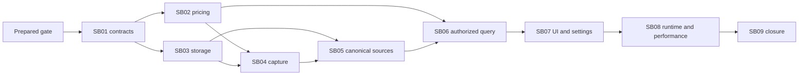

# Phase Plan

Current authorization is preparation only. Every phase below is future implementation
and remains Not started until the user authorizes execution. Do not launch a new task,
start a model call or mutate an active database merely by reading this plan.

## Execution Order

1. [SB01 — Contracts And Boundary Lock](../subbundles/01-contracts-and-boundaries/README.md) — Behavioral.
2. [SB02 — Shared Pricing Evidence](../subbundles/02-shared-pricing-evidence/README.md) — Behavioral.
3. [SB03 — History Storage And Lifecycle](../subbundles/03-history-storage-and-lifecycle/README.md) — Governed.
4. [SB04 — Invocation Capture And Caller Attribution](../subbundles/04-invocation-capture-and-attribution/README.md) — Governed.
5. [SB05 — Canonical Linking And Backfill](../subbundles/05-canonical-linking-and-backfill/README.md) — Governed.
6. [SB06 — Authorized Bounded History Search](../subbundles/06-authorized-history-search/README.md) — Governed.
7. [SB07 — History Tabs And Policy UI](../subbundles/07-history-tabs-and-policy-ui/README.md) — Behavioral.
8. [SB08 — Runtime And Performance Proof](../subbundles/08-runtime-and-performance-proof/README.md) — Governed.
9. [SB09 — Final Closure Audit](../subbundles/09-final-closure/README.md) — Standard.

Read the current phase, normative contracts, architecture checkpoints and execution report
before each entry. SB02/SB03 can proceed in parallel only after SB01 and only with disjoint
files; coordinate price/schema/DTO/DI changes rather than racing shared edits.

## Subbundle Dependency Map

SB08 also requires all SB01–SB06 proofs to remain valid, not merely SB07's UI status.
SB07 consumes SB03's policy store transitively through SB06. No partial foundation
completion authorizes downstream release.

| Phase | Prerequisites | Downstream checked before progressing |
|---|---|---|
| SB01 | Prepared gate | Price/storage/capture/source identity and typed dependencies. |
| SB02 | SB01 | SB03 price schema coordination, SB04 dispatch snapshot, SB06 price display. |
| SB03 | SB01 | SB04 durable capture, SB05 intent/replay, SB06 scalar query, SB07 policy contract. |
| SB04 | SB02 + SB03 | SB05 ownership/attempts and SB06 trusted caller/filter facts. |
| SB05 | SB03 + SB04 | SB03 cleanup activation, SB06 coverage/detail/deletion and SB08 recovery. |
| SB06 | SB02 + SB05 | Both SB07 scopes/settings and SB08 permission/query scale. |
| SB07 | SB06; SB03 policy remains valid | SB08 actual lazy-host/form/overlay acceptance. |
| SB08 | SB01–SB07 valid | SB09 evidence completeness and actual user outcome. |
| SB09 | SB08 | Final closure only; deployment and user-data operations remain separate. |

## Critical Subbundles

- SB01 is the identity/dependency foundation (Behavioral). A wrong source/attempt key
  invalidates pricing, storage, capture, projection and search; freeze it first.
- SB02 is the price evidence foundation (Behavioral). Unknown/free/provider-reported and
  long-count semantics must pass buffered and streaming paths before capture/display.
- SB03 is the durability/schema/profile foundation (Governed). Begin, outbox atomicity,
  detail quotas/protection and additive migration pass before producers depend on them.
- SB04 is the real-producer foundation (Governed). Generic wrappers alone do not cover MAF,
  callbacks, relay streams or batch recovery; each matrix row needs actual path proof.
- SB05 is the canonical/replay/deletion foundation (Governed). First creation after orphan
  expiry and every update/delete use durable source intents; cleanup stays disabled until
  this gate passes. A screen cannot substitute for source lifecycle evidence.
- SB06 is the query/authorization foundation (Governed). Bounded SQL, owner access and
  before-publication authority checks precede both UI surfaces.
- SB07 is the UI contract gate (Behavioral), including existing provider Save isolation and
  Settings dependency boundary. Desktop proof applies; mobile/shared component work does not.
- SB08 is the composed runtime/performance gate (Governed). Run one actual-diff justified
  affected regression checkpoint and record measured bounds. Missing infrastructure proof
  is a block, not a skipped success.
- SB09 is a Standard closure audit. Reuse valid upstream proof rather than rerunning suites
  solely to populate a new evidence directory.

## Phase Gates

- Each gate is blocking for its named dependents; record actual evidence and invalidation
  before progressing. The ordered checks below distinguish preparation from product closure.

1. **Prepared gate:** apply the preparation validator, link/source/traceability/dependency
   checks and independent architecture/performance/UI review. Product execution stays
   Not started even when this gate passes.
2. **Entry gate:** verify user authorization for implementation, current source drift,
   prerequisites, exact test discovery expectations, changed files/edges and proof tier.
   Use the subbundle validator before editing; repair missing contracts first.
3. **Owner closure gate:** capture required focused behavior/source/SQL/browser evidence,
   review changed architecture and update manifests/report. Discover zero tests or skip
   required PostgreSQL/host/browser proof means failure.
4. **Downstream gate:** check dependency invalidation explicitly. Do not let UI work hide
   a failed foundational state, source update, credential or query contract.
5. **Frozen SB08 gate:** name actual public-contract/schema/DI trigger and affected scope.
   One broadened impacted regression pass; no default all-solution or paid-model suite.
   Reuse still-valid focused evidence. Any later executable/fixture change reopens only
   affected proofs and the checkpoint if its own inputs changed.
6. **Final gate:** run completed-stage bundle/subbundle/architecture checks, inspect actual
   producer/consumer artifacts and close every in-scope raw note. No invented legacy price,
   identity, attempt precision or runtime proof.

## Rollout And Rollback Sequence

Introduce additive schema/contracts, then capture/pricing and durable source publication,
then backfill with visible coverage, then authorized readers/UI. Cleanup activates only
after ownership/deletion/recovery proof. A reader may show incomplete coverage honestly;
it must never claim that missing index rows prove no usage.

Rollback disables feature activation first, preserves additive data and canonical owners,
drains/recovers pending work and uses the original profile/identity namespace. No automatic
down migration, old-audit deletion, provider re-execution or mutation of the user's active
database is part of this bundle's preparation.

## Proof Storage And UI Target Policy

Governed evidence belongs under `proof/SBxx/` at the bundle root, with manifests,
semantic-invariants, exact command transcripts, hashes and screenshots. These paths are
future artifacts; absence is expected in a prepared-only bundle. Curated readiness findings
live in reviews; do not fabricate execution artifacts now.

CanDoItAll application UI target is desktop1920x1080. Require normal and relevant open
overlay states, first viewport, scroll owner and keyboard/focus review. No small/medium/
mobile tuning or sibling BaseLib edits are included. Component-MCP/browser unavailability
must be resolved through supported tools before the applicable implementation proof.
