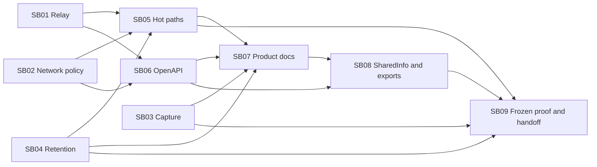

# Phase Plan

## Execution Order

1. SB01/SB02/SB03/SB04 repair independently owned protocol, source policy, capture and retention behavior.
2. Architecture checkpoints confirm safety and isolated proof. SB05 reduces repeated work after baseline behavior passes.
3. SB06 finalizes schema metadata after protocol decisions stabilize. It can run beside SB05 if request-policy edits are frozen.
4. SB07 updates product docs; drafting can start early, final claims wait for SB01–SB06.
5. SB08 exports final API/SQL evidence and updates SharedInfo skills after contract/doc freeze.
6. SB09 performs the one frozen merge checkpoint, reconciles historical host gates and hands back manual merge status.

## Subbundle Dependency Map

## Critical Subbundles

- SB01: external completion/failure semantics; must unlock with a real SDK downstream failure test.
- SB02: network authority; must unlock with an imported runtime graph and negative address test.
- SB03: privacy and outcome metadata; must unlock with actual persisted capture and explicit timeout/cancellation tests.
- SB04: retained-data lifecycle; must unlock with shared retry reference preservation and cleanup proof.
- SB06: contract export foundation; schema semantics must pass before export.
- SB09: Governed final checkpoint; all other units use their listed Behavioral or Standard tier.

## Phase Gates

- Preparation: structural validator plus independent semantic review.
- Entry: check source drift, prerequisites, exact owners and planned tests; discover actual counts.
- Closure: failing-first/passing behavior proof, architecture review where applicable, downstream check and explicit unlock.
- Final: no stale validation or historical pass copied forward; unresolved material proof keeps merge readiness false.

Parallel-safe ownership: SB01 HTTP relay/Web streaming; SB02 Composition selector/URI policy; SB03 history capture/decorators; SB04 retention. SB05 waits because it touches shared HTTP policies and catalog freshness. SB06 owns Web schema metadata; coordinate tests when both units touch the same integration class.

UI work is validation of existing large-screen desktop behavior, not redesign. Do not add mobile work or modify Components.
