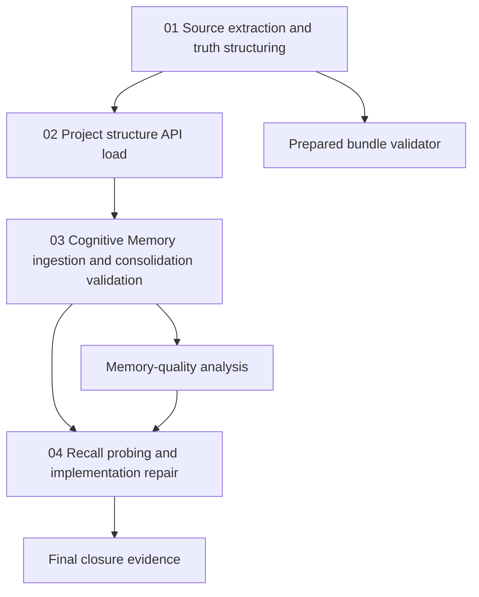

# Phase Plan

## Phase Sequence

1. Extract source packs and curate time-sliced source truth.
2. Validate the prepared bundle and source-truth manifest.
3. Load both projects through the project-structure API stage by stage.
4. After each stage, upload the stage source chunk, ingest project structure, consolidate, make review decisions, snapshot, and run a recall probe.
5. Run memory-quality analysis against required source-truth terms.
6. If the analysis exposes an implementation defect, patch the Cognitive Memory implementation and rerun the failing validation path.
7. Close the bundle with final validator output and evidence links.

## Subbundle Dependency Map

## Critical Subbundles

- `01-source-extraction-and-truth-structuring` is the foundation because every node and probe depends on the normalized source truth.
- `02-project-structure-api-load` proves the hierarchy exists and has useful parent/child context before memory ingestion.
- `03-cognitive-memory-ingestion-and-consolidation-validation` determines whether review decisions and consolidation are producing durable memories.
- `04-recall-probing-and-implementation-repair` is the final quality gate and the only phase allowed to trigger C# repair.

## Phase Gates

- Gate after preparation: run the bundle validator with `--stage prepared`.
- Gate before API loading: confirm source manifest, source-truth markdown, and loader script exist and parse.
- Gate after each API stage: readback must show nodes and links for that project/stage.
- Gate after consolidation: snapshot and review-decision evidence must be saved.
- Gate before repair: memory-quality analysis must identify concrete missing context, locator, or required-term failures.
- Gate before closure: rerun validators and update execution report with exact evidence paths.
