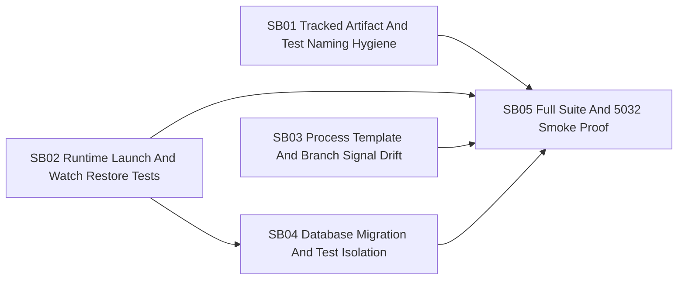

# Phase Plan

## Phase Sequence

1. Repair repository hygiene guards first so later full-suite proof is not blocked by known tracked-artifact/name violations.
2. Repair runtime launch and watch restore test drift because this affects the requested `5032` rebuild/start path.
3. Repair process-template and branch-signal drift because those failures are process-runtime behavior and should not be mixed with repository hygiene.
4. Repair or prove database migration/test isolation after the deterministic failures are gone.
5. Run full validation and rebuild/start/smoke-test `5032`.

## Subbundle Dependency Map

## Critical Subbundles

- SB01 is a critical hygiene foundation. If it is weakened, full-suite proof loses value.
- SB02 is critical for `5032` rebuild/start confidence and watch startup performance.
- SB03 is process-critical. Weak proof could hide broken branch routing in automation runs.
- SB04 is critical for database stability. A false migration decision can create schema churn or leave order-dependent failures.
- SB05 is the final closure and live-runtime proof.

## Phase Gates

- Gate after preparation: run the bundle validator and repair failures.
- Gate after SB01: hygiene tests pass without broad scanner disablement.
- Gate after SB02: runtime launch/watch targeted tests pass with current layout and realistic stale-reference fixtures.
- Gate after SB03: branch-signal recovery tests pass with positive and negative semantic cases.
- Gate after SB04: isolated DB test, EF pending-model check, and any order-reproduction proof are recorded.
- Gate after SB05: build, targeted tests, full unit run or documented remaining unrelated failures, and `5032` browser/API smoke proof are recorded.
