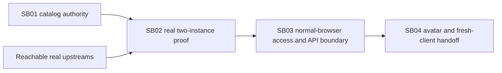

# Phase Plan

## Execution Order

1. SB01 authoritative catalog/pricing refresh and kind-change isolation.
2. SB02 rebuild both apps, UI setup against real providers, parity/execution/usage proof.
3. SB03 repair normal-browser Simple Chats access and revalidate both deployed hosts.
4. SB04 consistent avatars, rebuilt pair and isolated manual-setup third client.

## Subbundle Dependency Map

## Critical Subbundles

- SB01 is the critical foundation, Proof tier: Governed. Required downstream check:
save/reload source, publish/synchronize, assert exact client catalog and prices.
SB02 Proof tier: Governed because prior acceptance was disputed.
No full-suite gate. Dependency criticality does not broaden test scope.
SB03 Proof tier: Governed. N005 reopens normal-browser handoff, not catalog correctness.

## Phase Gates

- Prepared validator and architecture entry review before production edits.
- SB01 targeted discovery/tests/build and semantic proof before SB02 deployment.
- SB02 actual UI and provider evidence before final closure.
- Ollama-unavailable cases remain Blocked; other in-scope verification proceeds.
- Freeze test selection from --list-tests output before each execution. Zero fails.
- Reopen SB01 for catalog/price injection after refresh or round-trip; revalidate SB02.

## UI Target Policy

1920x1080 desktop. Preserve existing split provider list/editor, tabs and agent/chat dialogs.
Main editor or dialog body owns vertical scroll; price table owns horizontal scroll.
No mobile tuning or shared BaseLib changes.
