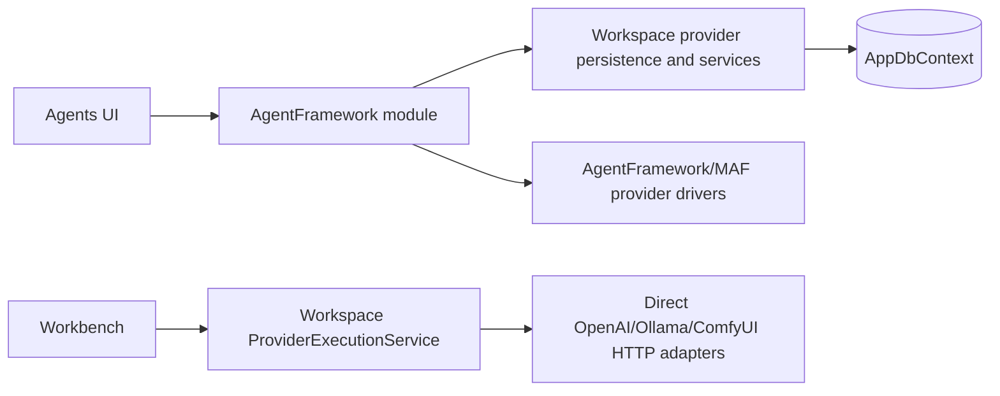
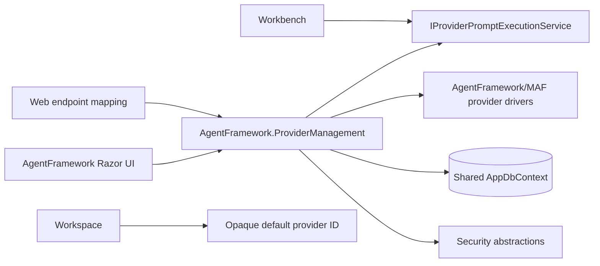

# Architecture analysis

## Executive finding

The Workspace leakage is real and material, but it was not mainly caused by Codex inventing an implementation direction. The original bundle explicitly instructed Codex to make Workspace EF canonical and to place the full shared-provider application model in Workspace. Codex then implemented a large part of the requested boundary faithfully.

A fair attribution is approximately:

| Cause | Weight | Explanation |
|---|---:|---|
| Original bundle architecture | 80% | It converted current placement into a target decision, made the decision non-reopenable, and explicitly assigned entities/services to Workspace. |
| Codex execution judgment | 20% | It should have raised the conflict with the user's request to avoid reversed module references and recognized forty provider-control-plane files in Workspace as a boundary smell. |

The corrective action must therefore replace the decision model, not merely ask a stronger model to “clean up” namespaces.

## Direct evidence in the original bundle

The historical bundle contains all of these target statements:

- Workspace EF provider rows are canonical.
- `ProviderSharePublication`, `SharedProviderSource`, `SharedProviderImport`, `SharedProviderInvocationRecord`, and related application services are Workspace-owned.
- AgentFramework maps Workspace rows into runtime profiles.
- AgentFramework-to-Workspace dependency remains part of the intended graph.
- SB02 explicitly asks for five Workspace-owned relational entities.

This conflicts with the original architectural intent to avoid reverse references and with the semantic nature of the data.

## Semantic ownership test

The new entities describe an application instance's provider control plane:

- remote source base URI
- token secret reference
- remote instance identity
- synchronization and network state
- publication eligibility
- imported provider revision
- relay invocation audit

They do not identify or aggregate under a workspace. There is no natural workspace aggregate root, workspace lifecycle, or workspace invariant that owns them. Their namespace was selected because existing provider persistence happened to be in Workspace, not because their domain belongs there.

## Pre-existing root cause

Before shared providers, `AddWorkspaceModule()` already registered or owned:

- OpenAI, Ollama, ComfyUI, scenario, and process-mock adapters
- a provider registry
- direct provider execution
- a provider runtime gateway
- provider profile persistence and editing
- secret mutation
- provider health, pricing, and manifest behavior
- provider database transfer

At the same time, `CanDoItAll.AgentFramework.Providers` already described itself as the provider-driver/runtime layer that UI, processes, and MAF should use instead of direct SDK calls.

This created two provider systems:

The duplicate systems made Workspace look like the only practical place to add shared providers. The bundle then reinforced the accidental architecture.

## Why a folder move is insufficient

Moving `Workspace/SharedProviders` to another namespace while keeping these dependencies would leave the defect intact:

- provider profile master still in Workspace
- AgentFramework provider registry still backed by Workspace services
- Web shared-provider APIs still calling Workspace application services
- Workbench still using Workspace direct inference
- DI registration order still replacing one provider gateway with another
- database transfer still treating providers as Workspace state

The correction must move canonical ownership and remove the duplicate runtime path.

## Current implementation worth preserving

The implementation contains valuable behavior that should not be discarded:

- effective-profile materialization for shared imports
- revision-aware runtime snapshots
- fail-closed secret/source validation
- publication and discovery protocol
- import reconciliation and deletion handling
- relay audit and recovery
- rate limiting
- image target routing
- host-level API separation

The bundle treats the current code as behavior to transplant and test, not as a failed prototype to rewrite.

## Why not place everything in `CanDoItAll.AgentFramework.Providers`

The existing MAF provider project is a lower-level runtime/driver layer. Shared-provider administration requires EF Core, persistence, secret storage, synchronization state, audit, and application orchestration. Putting those concerns into the inner provider project would reverse a different boundary and contaminate reusable MAF code.

A dedicated outer ProviderManagement project provides the correct middle layer:

## Why shared AppDbContext is not a problem

A shared physical DbContext is an infrastructure composition choice. EF configurations can be discovered from multiple module assemblies. CLR type ownership, service ownership, and dependency direction can be corrected without changing the database or introducing a new DbContext.

The existing `Workspace_` table prefix is misleading but not dangerous enough to justify a data migration during this boundary correction. Renaming it would add rollback and production-data risk without improving compile-time architecture.

## Why Ultra spent excessive time on bundle files

The original execution contract required repeated architecture-skill reads, per-subbundle manifests, proof reuse, status updates, traceability, changed-file inventories, and repeated acceptance documentation. That made documentation maintenance part of every checkpoint and encouraged the model to spend context on the bundle instead of source.

This recovery bundle intentionally uses:

- one decision lock
- one target-boundary document
- one README per subbundle
- one result per subbundle
- one executable boundary guard
- one final acceptance list

No hash manifests or duplicated proof files are required.

## Main risks and controls

| Risk | Control |
|---|---|
| Existing databases lose provider rows | Keep physical table names and migrations; require no pending model changes. |
| Shared-provider runtime semantics regress | Characterize revision, secret, reconciliation, relay, and audit behavior before moving code. |
| A new duplicate runtime appears in ProviderManagement | BR04 removes legacy direct inference and architecture guards reject old adapter/execution types. |
| AgentFramework gains a new Workspace cycle | New project and provider-specific AgentFramework folders have hard no-Workspace guards. |
| Workbench loses LLM rewrite behavior | Move it to a narrow MAF-backed execution port and retain focused tests. |
| UI has two provider editors | Agents tab remains authoritative; Workspace editor code is removed, redirect retained. |
| EF migration emits destructive SQL | Only a verified no-op metadata migration is allowed. |
| Docker blocker consumes the run again | Docker/Podman is forbidden in this bundle. |
