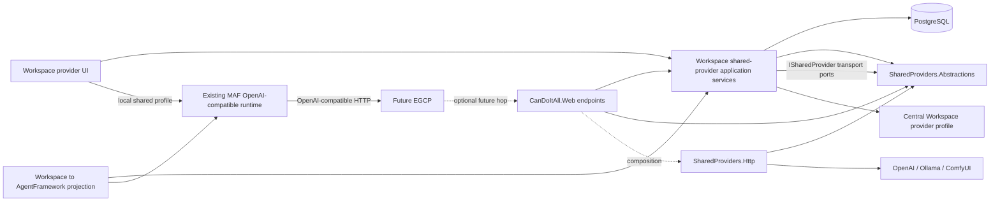

# C# boundary map

Required by the C# architecture bundle guard.

## Target boundaries

The diagram shows logical ownership. Composition registration belongs in the outer
Composition/Web layer; Workspace never references the concrete HTTP implementation.

## New lower-level projects

Preferred names, subject to SB00 current-layout verification:

SB00 verified the current layout and retained this two-project shape. No existing project owns
both the SDK-free protocol and the outward HTTP implementation without creating a dependency
inversion, so later subbundles must not collapse it without reopening the architecture gate.

### `src/Integration/CanDoItAll.SharedProviders.Abstractions`

Owns SDK-free, EF-free, ASP.NET-free types:

- public catalog records and protocol constants;
- shared-provider operation/capability enums;
- routing model ID value/codec contract;
- source catalog client port;
- central inference transport port;
- upstream adapter descriptor/support records;
- neutral relay request/response/session contracts;
- typed failure categories;
- no provider SDK types;
- no Workspace entity types;
- no `HttpContext`;
- no secret persistence implementation.

It may reference `CanDoItAll.SharedKernel` only when a current canonical Result/Error/value
object is required. Prefer zero project references when practical.

### `src/Integration/CanDoItAll.SharedProviders.Http`

Owns:

- source `HttpClient` implementation;
- bounded OpenAI-compatible request validation and mapping;
- upstream OpenAI/Ollama/ComfyUI relay adapters;
- adapter registry and target normalization;
- redirects/network enforcement;
- streaming response transport and usage extraction;
- external wire quirks and private DTOs;
- no EF entities;
- no Razor/UI;
- no Web endpoint definitions;
- no direct secret-store lookup.

It references Abstractions and the smallest current lower-level HTTP/shared-kernel projects.
It does not reference Workspace or Web.

If the current dependency graph makes the two-project shape unnecessary, SB00 may collapse them
to one SDK-free integration project only when the before/after dependency proof shows no
contract/implementation inversion. It may not move protocol records into Web or Workspace just
to avoid a project.

## Existing ownership retained

### Workspace

Owns:

- `ProviderSharePublication`;
- `SharedProviderSource`;
- `SharedProviderImport`;
- `SharedProviderInvocationRecord`;
- EF configurations and application services;
- publication eligibility and sanitized projection;
- source/import state machine and reconciliation;
- secret-reference selection through existing Security services;
- runtime effective-profile materialization;
- local UI view models.

New types live in cohesive files/folders, not `WorkspaceModels.cs`.

### Web

Owns:

- route mapping;
- body/request limits attached to routes;
- auth policy application;
- native versus OpenAI error envelopes;
- response headers and SSE HTTP semantics;
- access-context middleware binding;
- OpenAPI metadata.

Web delegates routing, policy, persistence, and upstream work.

### AgentFramework module

Owns only the outer projection from Workspace rows into existing AgentFramework profiles. It
may understand `provider.candoitall-shared` origin metadata. Inner MAF/Providers projects do not
understand Workspace source/import entities.

## Forbidden boundary crossings

- MAF/Core -> Workspace/Web/EF/SharedProviders.Http
- Abstractions -> Workspace/Web/UI/EF/provider SDK
- Http -> Web/UI/EF/Workspace entities
- Workspace -> Http concrete classes
- Protocol DTO -> `ProviderProfile`, `Secret`, `DbContext`, `HttpContext`
- Razor component -> direct `HttpClient` or EF context
- API endpoint -> direct upstream provider SDK

## SB01 realized boundary

- `CanDoItAll.SharedProviders.Abstractions` is present under `src/Integration` with zero package
  and project references.
- The protocol, identity, routing, failure, catalog-client, inference-transport, and read-only
  access-context contracts live only in Abstractions.
- `CanDoItAll.Web` owns the scoped mutable state and middleware that validates and binds the
  optional access-context header after authentication/authorization setup and before endpoint
  dispatch.
- No Workspace, Http implementation, EF entity, provider SDK, catalog route, inference route, or
  UI surface was added in SB01.

This realizes the first half of the locked two-project Integration boundary. The concrete Http
project remains owned by SB04; SB02 may add only the inward Workspace-to-Abstractions edge.

## SB02 realized boundary

- All new EF entities, configurations, transitions, repositories/services, reconciliation, audit,
  and deletion policy live in cohesive Workspace files.
- Workspace references only SharedProviders Abstractions; no Workspace-to-Http edge exists.
- Foundation owns the reusable PostgreSQL exception classifier without referencing Workspace;
  Migrations discovers Workspace configurations through the existing registry.
- AgentFramework usage receives only SDK/EF-free enum/selection additions, and its delete surface
  consumes the Workspace-owned policy at the existing outer module boundary.
- No public HTTP DTO, endpoint, outbound HTTP implementation, provider SDK, Razor component,
  reflection bridge, or service locator was introduced.

The second Integration project is now assigned to SB03/SB04: SB03 may create the descriptor-only
Http shell needed for eligibility/catalog composition, while SB04 owns concrete relay transport.

## SB06 realized boundary

- Workspace owns graph validation and effective shared-profile materialization.
- The AgentFramework module owns EF loading, mapping, catalog projection, and post-commit refresh.
- Models owns SDK-neutral typed credential, network, feature, exact-model, and audio-availability
  contracts.
- Providers and MAF reuse their existing OpenAI-compatible paths; they receive complete effective
  profiles and do not reference Workspace, Web, UI, or SharedProviders.Http.
- Composition owns hardened named-client selection and per-request access-context propagation.
- The voice component consumes the same typed audio policy as the runtime guard and cannot replace
  an ineligible explicit selection with a personal provider.

This preserves the locked anti-corruption boundary. Shared origin affects selection and policy, not
the shape or ownership of the agent runtime.
