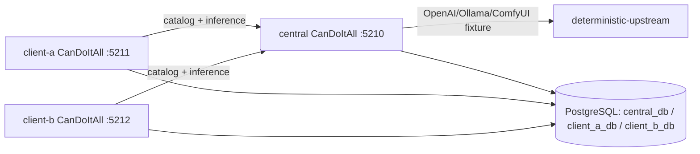

# Docker multi-instance topology

## Required topology

The exact host ports may change if occupied; the runbook must record them.

## Services

- one prebuilt CanDoItAll app image reused by central/client-a/client-b;
- one PostgreSQL 16 service with three independent databases and users, or three DB services
  only when current tooling makes shared server isolation unsafe;
- one deterministic upstream test provider container;
- optional one-shot E2E orchestrator container/process;
- independent app data roots and host binding IDs.

## State roots

Use ignored bind directories under:

`.artifacts/shared-providers-e2e/`

Suggested:

- `central/data`
- `client-a/data`
- `client-b/data`
- `credentials/`
- `logs/`
- `handoff/`

Never commit generated tokens, signing keys, vault files, connection passwords, or handoff
secrets. Track only `.example` files.

## Deterministic upstream

It must support enough behavior to prove:

- `GET /v1/models`;
- Chat Completions normal and SSE;
- Responses normal and SSE;
- function tool call output;
- structured JSON response;
- image generation;
- controllable delays/cancellation;
- 400/401/429/500/timeout fixtures;
- request-header/body capture for assertions;
- no external network.

Prefer a small repository-owned ASP.NET test-support host over an unpinned third-party proxy
image. It is not a production dependency.

## E2E orchestrator

Create a non-production tool that:

- generates ephemeral API signing keys/tokens and stores them in ignored files;
- creates databases through supported initialization;
- configures secrets/providers/publications/sources/imports using canonical application
  services, not direct SQL;
- can reset only the dedicated E2E artifact root/databases;
- runs scenario assertions and writes machine-readable results;
- never adds an unauthenticated production endpoint;
- redacts secret values in stdout and proof artifacts.

## Backend checkpoint scenarios

At minimum:

1. central catalog with one published text profile, one published image profile, one unshared
   profile;
2. client-a imports text and keeps a personal provider;
3. client-b imports text and image;
4. repeated sync no duplicates and stable IDs;
5. same upstream model name on two publications routes correctly;
6. Chat Completions and Responses normal;
7. both streaming surfaces;
8. function tool call round-trip;
9. structured output allowed/denied;
10. image generation through OpenAI-compatible and ComfyUI-style adapters;
11. catalog ETag/304;
12. missing/wrong scopes;
13. malformed access context;
14. access context central-only;
15. unpublish and reappearance;
16. central outage and recovery without fallback/deletion;
17. source identity mismatch;
18. streaming cancellation;
19. log/database secret/content scan.

## Final behavior

SB12 starts from a clean E2E state, runs the final lane, and intentionally does not call
`docker compose down`.

It writes `manual-handoff.md` containing:

- service names and health;
- URLs;
- local fixture/profile/source names;
- operations to test;
- non-secret artifact/credential file locations;
- logs path;
- exact cleanup command labeled `NOT EXECUTED`.

The handoff must not paste tokens or passwords.
