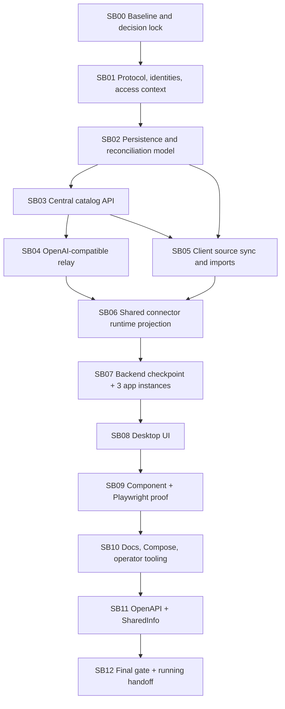

# Dependency graph

## Critical foundations

- SB00 project/dependency and runtime-path decision lock.
- SB01 wire/identity/access-context contracts.
- SB02 relational ownership and transaction semantics.
- SB07 backend behavior across real instances.

Downstream work may not compensate for failure in a foundation.

## Parallelism policy

The bundle is intentionally serialized for one Codex run. Small documentation/test-fixture work
may be prepared inside its owning subbundle, but no downstream production implementation starts
before its dependency gate.

## Reopen propagation

- protocol change -> reopen SB01 and recheck SB03-SB12;
- entity/invariant change -> reopen SB02 and recheck SB03, SB05-SB12;
- capability/relay change -> reopen SB04 and recheck SB06-SB12;
- runtime projection change -> reopen SB06 and recheck SB07-SB12;
- public API/OpenAPI change after SB11 -> reopen SB11 and SB12;
- UI-only copy/layout change after SB09 -> reopen SB09-SB12, not backend foundations unless
  service contract changed.
