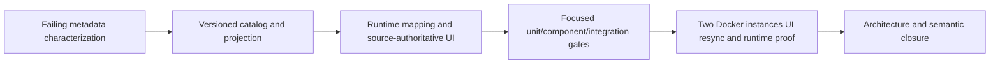

# SPMETA — source metadata mirroring

State: `DONE` (full model-catalog parity repair validated). Proof tier: `Governed`.
Owner: current operator repair lane. Current repair plan: [full-catalog-repair.md](full-catalog-repair.md).

The latest full-catalog closure is [RESULT.md](RESULT.md) and
[full-catalog-manifest.md](proof/full-catalog-manifest.md): 167 focused tests and two
complete two-instance UI/runtime runs pass, with source/client model-set parity.
The original metadata plan and results below remain historical context.

## Objective and covered inputs

Repair the 2026-08-27 screenshot feedback: shared model names must match the central
instance; source model prices and private-provider state must be mirrored, without
OpenAI driver defaults contaminating imported Ollama or OpenAI profiles. Validate
again using the two existing isolated Docker instances and UI configuration.

Raw input and screenshot mapping: [inputs.md](inputs.md). SPMETA owns every row.
The original SB07 three-application/budget gate remains blocked and is not bypassed.

## Compatibility map and prerequisites

This is a feedback work unit within the existing shared-providers bundle, not a new
parallel bundle. Inputs, requirements, inventory, architecture, plan, proof and closure
are the sections here plus inputs.md, proof/ and RESULT.md. Root STATUS.md remains the
status authority. Historical SB00–SB12 and boundary-recovery evidence is preserved.

Prerequisites: existing control-plane boundary and two-instance UI lane completed;
operator explicitly authorizes this defect repair and two-instance rebuild/validation.
Inspected HEAD: `f092472ab83d36caf0e0fb52119d57d7aad35a65`; worktree initially clean.
Existing containers: shared 5210, client 5212, upstream fixture 5213, isolated PostgreSQL.
No live paid-provider claim: deterministic upstream verifies transport, UI and usage.

## Current-state inventory and exact source references

- Integration/CanDoItAll.SharedProviders.Abstractions: SharedProviderCatalogContracts.cs
  contains model IDs/display names but no prices/private flag; strict JSON rejects unknown
  fields. SharedProviderCanonicalRevision.cs hashes the public representation.
- Modules/CanDoItAll.Modules.AgentFramework.ProviderManagement/SharedProviders:
  SharedProviderCatalogProjection.cs fabricates provider-number model names.
  SharedProviderRuntimeProfileMaterializer.cs validates saved snapshot/cache and keeps models.
  SharedProviderReconciliationCoordinator.cs replaces remote-owned fields on sync.
- Modules/CanDoItAll.Modules.AgentFramework/Providers/SharedProviderProfileMapper.cs drops
  model labels and assigns IsPrivateProvider=false, ModelPrices=[].
- MAF/Common/CanDoItAll.AgentFramework.Models/Providers: ProviderModels.cs owns runtime
  IDs and pricing; ProviderPricingModels.cs owns price metadata/calculation.
- Modules/CanDoItAll.Modules.AgentFramework/Pages/Components:
  AgentProviderProfilesPanel and ProviderModelPricingEditor render settings. Pricing editor
  initializes missing prices from transport kind in OnParametersSet, even when disabled.
  AgentDetailsDialog renders selected-model policy text.
- UI/CanDoItAll.Conversations.Components: ConversationProviderModelSelector and
  Presentation/ConversationProviderOption currently use a string as both value and label.
  MAF/Common/CanDoItAll.AgentFramework.Components/AgentProviderPresentationMapper maps it.
- Existing tests: SharedProviderPublicationAndCatalogTests, SharedProviderProtocolContractTests,
  SharedProviderRuntimeProfileMaterializerTests, SharedProviderRuntimeProjectionIntegrationTests,
  ProviderModelSelectorTests, ProviderModelPricingEditorTests,
  SharedProviderTwoInstanceUiAcceptanceTests. Missing: names/prices/private metadata propagation,
  source-price change invalidation, empty source prices and source-managed UI mutation negatives.

All source references above are under repo://src/; test classes under repo://tests/.

## C# architecture impact / boundary ownership

Contract DTOs stay in SharedProviders.Abstractions, independent of MAF/UI. A typed pricing
DTO carries USD-per-million standard/cache-write/long-context fields; a small explicit mapper
in ProviderManagement adapts MAF price records. Catalog publication, validation, hashing,
reconciliation and materialization remain in their existing owners. Runtime profile contains
model identity/display metadata; UI maps labels without changing request values.

This is metadata contract/projection repair, not runtime extraction. Existing projector and
materializer have no injected dependencies; UI code-behind remains rendering/orchestration.
No new runtime partial, service locator, generic framework, SDK or project is justified.
No existing owner receives a second unrelated responsibility.

Execution finding: schema-1.0 saved snapshots would otherwise prevent management UI from
listing sources. Extracted the existing strict snapshot reader into the cohesive top-level
SharedProviderPublicationSnapshotReader, shared by runtime materialization and management
projection. Invalid/old snapshots are explicitly IncompatibleContract in management while
source synchronization remains available. Materializer shrank; no partial or project added.

Validation found two further defects inside this ownership contract. A removed-model warning
was lost on an ordinary selector rerender; an adversarial component test reproduced it and
the source-managed selection is now reapplied. Visual review then found that the source's
edited private flag reverted after save: CreateProfile was rereading the old pricing JSON.
The save boundary now synchronizes typed editor pricing/private state into configuration
before normalization. Both toggle directions require failing-first/pass unit proof, and the
UI helper must reopen the provider and verify the requested flag after persistence. Merely
comparing two equally wrong values is not adequate proof. This invalidates the preliminary
UI passes for META-PRIVATE resynchronization; final-image reruns are required.

## Dependency direction

No project-reference changes. UI/module -> ProviderManagement/MAF -> models/contracts;
SharedProviders.Abstractions must not reference MAF, persistence, or UI. Baseline CodeAnalytics
snapshot `snap-20260827100739-e9442d71`: 1 scoped project, 67 documents, no blocking load errors,
244 dependency edges, no cycles in that scope. Scope excludes external references, so it
cannot prove the complete graph. Existing architecture/boundary guards provide that check.
Hotspots include ProviderMetadata (777 lines), registry (559), administration (673),
materializer (574); no broad expansion or new partial files permitted.

## Pattern decision / testability contract

Use existing projector/adapter boundaries plus immutable typed metadata. Reject parsing hashes
or replacing request IDs with model labels: collisions would break routing. Reject default-price
fallback: it invents source facts. Reject transport-kind changes: shared Ollama still uses the
OpenAI-compatible relay. Direct tests exercise pricing mapping, canonical revision and catalog
projection without full runtime construction; component tests prove labels emit original IDs.

## Implementation plan and architecture checkpoints

1. Record failing-first semantic tests and before hashes.
2. Publish actual names and typed prices/private flag; include all public metadata in revisions.
   Advance catalog schema for strict readers; old clients explicitly reject incompatibility.
   Both test engines upgrade together; existing imports are refreshed through UI without
   recreating IDs/agents. An old cached snapshot must not silently invent metadata.
3. Preserve model routing values in runtime/agent records; propagate display metadata and
   exact prices/private state; prevent source-managed empty prices from default initialization.
4. Update provider settings, agent and conversation selectors/policy labels. Keep ownership
   controls enforced server-side, not merely disabled HTML.
5. Foundation checkpoint: focused tests, canonical sensitivity, no new project references or
   partial boundaries, known local-provider behavior preserved. Then allow Docker UI proof.
6. Configure central distinct prices and model list via UI, synchronize client via UI, compare
   exact names/prices/private state; change source and resync; verify stable IDs and removed
   stale entries. Run chat, image generation and image analysis, confirm central usage records.
7. Architecture review, semantic/red-team review, hash manifest and honest root status update.

## Scope, constraints and validation depth

- Prices are authoritative for the published model set; do not advertise price-only models
  as callable or import unrelated transport defaults. Missing price remains unpriced.
- Public model names are intentionally disclosed as requested. Endpoint addresses, secret
  references, credentials and configuration remain private.
- Preserve named volumes and current data; replacement containers have rollback backups.
- Keep localhost 5032 and unrelated PostgreSQL untouched. No broad solution regression or
  original three-app lane without a named need/authorization.
- Existing xUnit v2 / VSTest on .NET 10.0.302. Discover exact filters before each named lane;
  unexpected/zero discovery is invalid proof. Build once per changed checkpoint; --no-build
  only for the fresh matching binaries. Record selected tests/counts in proof manifest.
- Governed transcripts and before/after hashes under proof/. Failing-first same-test proof,
  positive/negative assertions, anti-stub audit and UI screenshots required.

## UI composition and proof questions

1920x1080 desktop. Retain split provider list/editor for rapid comparison; alternate settings
remain tabs. Prices/models are primary, supporting source-ownership text is adjacent and compact;
counts remain badges. Existing agent configuration dialog width and stable footer are retained;
dialog body owns scrolling, provider editor owns settings scrolling. No textarea resizing or
application-shell/mobile redesign. First viewport must show readable provider identity/default
and price rows or agent model control. Capture/review model dropdown open inside the real
dialog column: labels readable, no hash labels, clipping, harmful overflow or footer overlap.
Inspect both normal settings and empty-price state. Components MCP recommendation was attempted
twice but returned Transport closed; preserve inspected existing shared components, no new CSS.

## Acceptance and progression gate

- [x] Model labels match source; duplicate names across publications still route independently.
- [x] Source standard, cached, cache-write and long-context prices round-trip exactly, including
  null and zero; private flag mirrors source; no unrelated OpenAI prices on imported Ollama.
- [x] Source metadata changes alter revision/ETag and resync replaces stale metadata with stable IDs.
- [x] Empty metadata cannot trigger defaults; legacy/incompatible input fails explicitly.
- [x] Agent/settings/chat labels readable; selected request values remain opaque routing IDs.
- [x] UI-created settings and two-instance chat/image/vision work; central ledger records usage.
- [x] Focused regression, architecture, source assertions, anti-stub and evidence reviews pass.

Only then SPMETA becomes DONE. Original SB07/downstream states remain unchanged.
Reopen on changed public serialization, reconciliation, model selection, source ownership,
pricing defaults, failing UI/runtime evidence, or missing governed artifacts.

## Readiness gate

Manual semantic gate for compatible legacy shape: PASS. Raw input mapping, concrete owners,
dependencies, tier, negative/positive proof, UI questions, architecture decisions and closure
requirements are present. Frozen preparation-only root validator is not applicable after the
historical execution; no manifest or historical status is rewritten to fake that gate.

## Closure and handoff

Final image-3 UI runs metadata-ui-closure-2 and metadata-ui-closure-repeat pass the strengthened
source-save/reload assertion and all downstream operations. Final focused lanes passed
161 unit, 217 dependent-consumer, 46 integration and 38 component executions. Source/boundary
checks and primary-agent architecture/visual/semantic reviews pass within the recorded scope.
Artifact gate: proof/Validate-Closure.ps1 and proof/transcripts/closure-validation.txt.
Raw notes are closed in inputs.md; operator handoff and limitations are in RESULT.md.
CodeAnalytics impact selection and Components MCP availability gaps are explicit in proof;
there is no whole-graph/full-suite/live-provider or billed-cost claim.
