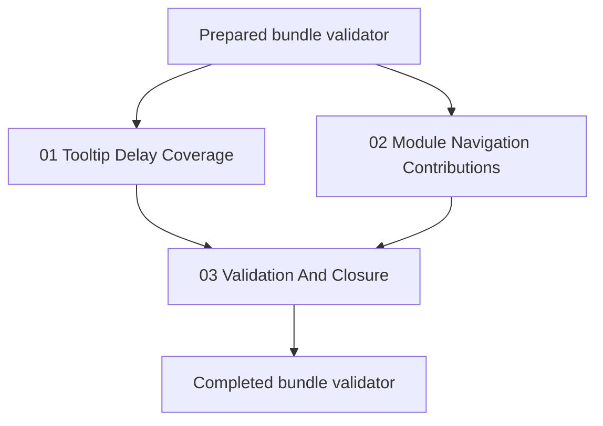

# Phase Plan

## Phase Sequence

1. Prepare and validate the bundle.
2. Execute `01-tooltip-delay-coverage`; close it only after code review or browser proof shows delayed menu tooltips and no popup-trigger tooltip regression.
3. Execute `02-module-navigation-contributions`; close it only after tests and desktop browser proof show `Workflows` immediately after `Agents`.
4. Execute `03-validation-and-closure`; run targeted tests, browser proof, final raw-note audit, and completed-stage validation.

## Subbundle Dependency Map

- `01-tooltip-delay-coverage` and `02-module-navigation-contributions` can be implemented independently after the prepared gate, but both must pass before final closure.

## Critical Subbundles

- `01-tooltip-delay-coverage` is a critical UI interaction foundation. It needs real hover timing proof because tooltip regressions are browser-visible.
- `02-module-navigation-contributions` is a critical navigation composition foundation. It needs route/order tests plus browser proof because weak merging would affect all module menu extensions.

## Phase Gates

- Gate after preparation: run the bundle validator and repair failures.
- Gate before each subbundle: confirm prerequisites are complete and still valid.
- Gate after each subbundle: capture proof, review screenshots, and decide whether downstream work may continue.
- Gate before closure: rerun validators, close raw notes, and reopen anything with weak proof.
