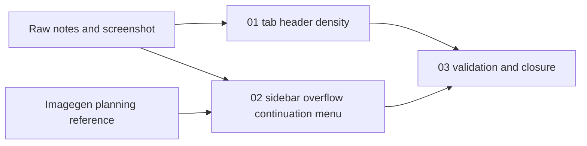

# Phase Plan

## Execution Order

1. `01-01-tab-header-density`: compact the large-desktop tab/header row and preserve smaller layouts.
2. `02-02-sidebar-overflow-continuation-menu`: replace desktop nav scrolling with a `more_up` continuation menu and panel.
3. `03-03-validation-and-closure`: run Tailwind, targeted tests/build, browser proof, raw-note closure, and final validators.

## Subbundle Dependency Map

- `01` and `02` can be implemented independently but both must pass proof before `03` closes the bundle.

## Critical Subbundles

- `02-02-sidebar-overflow-continuation-menu` is the critical UI foundation because weak proof can hide inaccessible routes or clipped overlays across the whole app shell.
- Critical proof for `02`: component rendering test, no `overflow-y-auto` nav styling, and browser open-state screenshot on a large desktop route.

## Phase Gates

- Preparation gate: `validate_bundle.py --profile feedback --stage prepared` passes and manual readiness review confirms raw note coverage.
- Entry gate for `01`: source references exist and this subbundle owns `R001` and `R002`.
- Closure gate for `01`: large desktop row structure is implemented and targeted tests or browser proof show search/status controls can share the tab row.
- Entry gate for `02`: `01` is complete or no shared CSS conflict remains; source references exist and this subbundle owns `R003` through `R006`.
- Closure gate for `02`: continuation menu renders, opens on hover/focus, avoids internal nav scroll, and passes browser open-state proof.
- Final gate for `03`: Tailwind output, tests/build, browser evidence, execution report, raw-note closure, and completed-stage validator all agree.
