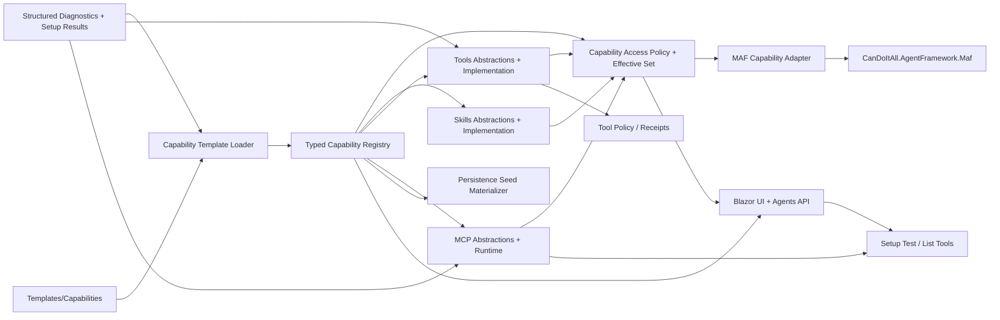

# Target Solution

## Target Architecture

The end state is a capability platform that MAF consumes, not a capability platform hidden inside MAF.



## Proposed Projects

| Project | Purpose | Dependency rule |
| --- | --- | --- |
| `CanDoItAll.AgentFramework.Capabilities.Abstractions` | Shared typed IDs, descriptor contracts, capability exposure descriptors, capability access policy contracts, structured diagnostics, validation result types, setup test result types, template schema models, and compatibility constants. | No MAF reference. Avoid `AITool` if possible. |
| `CanDoItAll.AgentFramework.Capabilities.Templates` | Load, validate, version, and materialize `Templates/Capabilities` files into typed descriptors. | References abstractions and models only. |
| `CanDoItAll.AgentFramework.Capabilities.Access` | Evaluate typed access policies for agents, processes, workflows, and runtime contexts; produce effective capability sets and suppression diagnostics. | References abstractions only. No MAF/UI dependency. |
| `CanDoItAll.AgentFramework.Skills.Abstractions` | Skill source descriptors, skill loader interfaces, resource/script policy contracts, and registered skill descriptors. | No MAF reference. |
| `CanDoItAll.AgentFramework.Skills` | File skill, inline skill, and registered skill loading/validation implementation. | References skill abstractions and Codex-compatible parser helpers. |
| `CanDoItAll.AgentFramework.Tools.Abstractions` | Internal/external tool descriptors, schemas, invoker interfaces, setup test contracts, operation/side-effect metadata. | No MAF reference; bridge to `Microsoft.Extensions.AI` only through adapter where possible. |
| `CanDoItAll.AgentFramework.Tools` | Internal tool implementations grouped by domain plus external process/http tool invokers. | May reference existing services through narrow interfaces. |
| `CanDoItAll.AgentFramework.Mcp.Abstractions` | MCP server descriptors, lifecycle ownership, list-tools/test contracts, allowed tool policy, transport contracts. | No MAF reference. |
| `CanDoItAll.AgentFramework.Mcp` | Internal hosted MCP lifecycle, local stdio client, remote HTTP client, secret binding, setup testing. | References MCP SDK; no UI dependency. |
| `CanDoItAll.AgentFramework.Maf` | Adapter only: convert isolated skill/tool/MCP outputs into MAF runtime objects. | Consumes abstractions and implementations; no hardcoded capability catalog. |

## Template Pack Shape

Target root: `Templates/Capabilities`

```text
Templates/Capabilities/
  manifest.json
  skills/
    file/
    inline/
    registered/
  tools/
    workspace/
    dotnet/
    documents/
    images/
    processes/
    project-structure/
    provider-native/
    external/
  mcps/
    internal/
    local/
    remote/
  policies/
    capability-access-policy.json
    tool-policy.json
    approval-defaults.json
  schemas/
    capability-template.schema.json
    capability-access-policy.schema.json
```

## Capability Access Boundary

Runtime attachment must go through a typed effective capability set. Agents, processes, workflows, setup UI, and MAF adapters must not independently decide which skills, tools, MCP servers, or MCP tools are hidden. The target policy model is defined in `architecture/05-capability-access-policy.md`.

Key invariants:

- Policy starts from assigned/enabled candidate capabilities and can restrict or require them; it does not grant missing capabilities.
- Skills, tools, MCP servers, and MCP tools expose a common capability exposure descriptor so new implementations participate without suppressor code changes.
- Template/UI strings are parsed once into typed value objects and enums. Runtime logic does not compare raw selector strings.
- Deny wins over allow, required capabilities denied by policy produce explicit diagnostics, and suppressed runtime attachments are visible in manifests/UI.
- Existing process `AllowedOperations` and coarse tool flags become compatibility inputs to the typed access policy, not a second hidden filter.

## Hard Boundary

Implementation must not reconnect MAF to new code until the contracts, implementations, core hardening checkpoint, template loader, seed hardening checkpoint, and setup tests have passing proof. Reconnection is SB08 by design, after SB01-SB07.

## Quality Boundary

Implementation must also satisfy `architecture/03-error-and-diagnostics-model.md`, `architecture/04-implementation-quality-guardrails.md`, and `architecture/05-capability-access-policy.md`. A capability service is not considered ready if it only handles successful load/call/start paths.
