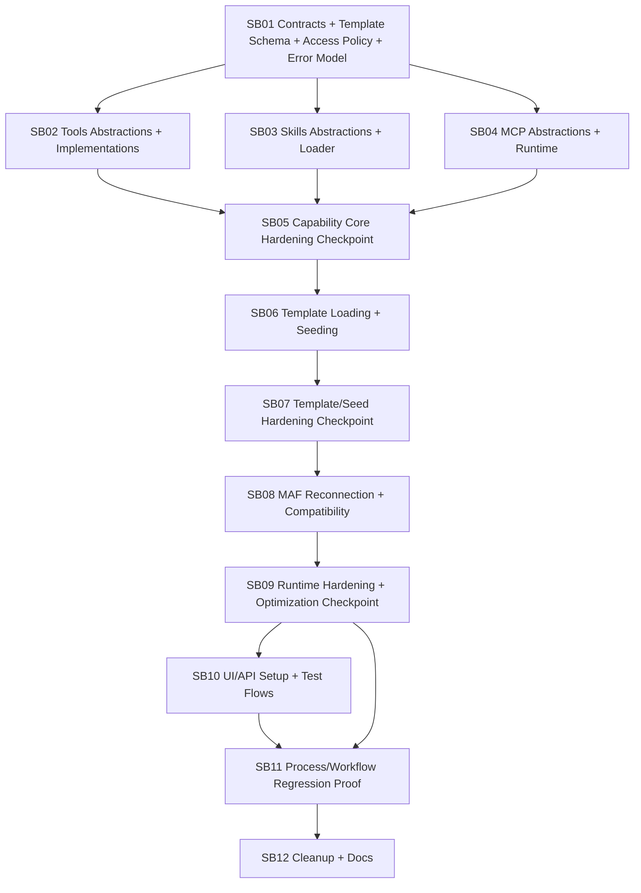

# Phase Plan

## Phase Sequence

1. SB01 defines contracts, naming, typed descriptors, capability exposure descriptors, access policy contracts, template schemas, structured errors, setup-test result types, and compatibility constants.
2. SB02 builds and tests tool abstractions, internal implementations, external process/http invokers, and tool exposure descriptors.
3. SB03 builds and tests skill abstractions, loaders, and skill exposure descriptors.
4. SB04 builds and tests MCP abstractions, lifecycle ownership, setup list-tools flow, and MCP server/tool exposure descriptors.
5. SB05 hardens the isolated capability foundation and access policy evaluator before templates or MAF can consume it.
6. SB06 builds and tests `Templates/Capabilities` loading, capability access policy loading, and seed materialization.
7. SB07 hardens template loading, access policy validation, seed parity, diagnostics, and managed seed behavior before runtime reconnection.
8. SB08 reconnects MAF to the new services and effective capability set after SB01-SB07 have passing proof.
9. SB09 hardens the runtime reconnection, removes adapter duplication and hidden filters, and runs focused performance/diagnostics proof before UI work.
10. SB10 reconnects UI/API setup flows for Tool, Skill, MCP, and capability access policy editing.
11. SB11 runs regression proof across agents, processes, workflows, capability restrictions, setup UI, and e2e scenarios.
12. SB12 removes obsolete hardcoded paths, documents conventions, and closes final validation.

## Subbundle Dependency Map

## Critical Subbundles

- SB01 is a critical foundation because every later subbundle depends on descriptor shape, capability exposure metadata, access policy contracts, naming, structured validation results, setup-test result types, and compatibility constants. It requires `proof/SB01/manifest.md` and `proof/SB01/semantic-invariants.md`.
- SB02 is critical because tools drive process execution, policies, approvals, and receipts. It requires fake internal and external call proof plus no-regression policy tests.
- SB04 is critical because MCP lifecycle and list-tools testing affect resource leaks and setup trust. It requires deterministic fake MCP server proof.
- SB05 is a hardening checkpoint because the isolated implementation projects and access policy evaluator must be refactored, performance-reviewed, and diagnostics-reviewed before templates or MAF consume them.
- SB06 is critical because it replaces hardcoded seed materialization and introduces template-backed capability access policies. It requires parity proof against existing seeded capability keys and compatibility proof for existing process operation rules.
- SB07 is a hardening checkpoint because seed/template behavior and policy validation must prove parity, deterministic failures, and no hidden fallback before runtime reconnection.
- SB08 is critical because it reconnects runtime behavior. It requires integration proof that old hardcoded switches and filters are no longer the active path.
- SB09 is a hardening checkpoint because runtime reconnection must not leave MAF as a renamed hub, introduce cycles, reapply hidden suppression, or regress capability-call performance before UI/API work begins.
- SB11 is the closure-critical regression gate across process/workflow behavior and e2e UI proof.

## Phase Gates

- Gate after preparation: run the bundle validator and repair failures.
- Gate before SB02-SB04: SB01 must pass schema, naming, access policy parsing/precedence, structured error, setup-test result, and compatibility unit tests.
- Gate before SB06: SB02, SB03, SB04, and SB05 must each have passing unit, integration, diagnostics, access-policy participation, and focused performance proof; no production runtime should consume partial implementations.
- Gate before SB08: SB06 and SB07 must prove template-backed seed parity, access policy validation, deterministic validation failures, and no fallback to old hardcoded defaults.
- Gate before SB10: SB08 and SB09 must prove MAF runtime composition through the effective capability set, actionable failure messages, bounded call behavior, no hidden second suppression pass, and reduced coupling.
- Gate before SB11: UI/API setup paths must save, test, and verify Skill, Tool, MCP, and capability access policy behavior with Playwright evidence.
- Gate before closure: run unit, integration, component, and Playwright e2e test subsets; update proof manifests; run final validator.

## Validation Matrix

| Phase | Unit | Integration | Component/UI | E2E |
| --- | --- | --- | --- | --- |
| SB01 | schema, naming, access policy conversion/precedence, structured errors, setup-test result tests | pack load smoke | N/A | N/A |
| SB02 | invoker, policy metadata, exposure descriptor, timeout, masking, bounded output tests | runtime tool composition | N/A | external tool setup smoke later |
| SB03 | skill loader, exposure descriptor, registered descriptor, external-root tests | skill catalog composition | N/A | skill setup smoke later |
| SB04 | MCP lifecycle/list/cleanup/exposure descriptor/error classification tests | fake MCP runtime attach | N/A | MCP setup smoke later |
| SB05 | diagnostics, access evaluator, allocation hot-path, mocking and file-size guard tests | isolated service composition and policy suppression smoke | N/A | N/A |
| SB06 | template materializer and access policy loader tests | seed parity and operation-rule compatibility tests | N/A | seeded capability list smoke later |
| SB07 | template/policy failure taxonomy and managed-seed guard tests | migration dry-run and parity proof | N/A | N/A |
| SB08 | adapter and effective-set tests | MAF execution composition and suppression diagnostics | N/A | process smoke later |
| SB09 | runtime diagnostics, no-fallback/no-hidden-filter, performance guard tests | runtime composition and cleanup proof | N/A | N/A |
| SB10 | setup and access-policy service tests | API endpoint tests | bUnit setup wizard and policy editor tests | Playwright setup/access-policy flows |
| SB11 | access policy regression tests | process/workflow runs with restrictions | capability panel/access editor regression | full Playwright route smoke |
| SB12 | dead-code guard tests | final build/test | final UI check when touched | final e2e closure when touched |

## Checkpoint Exit Criteria

| Checkpoint | Must prove | Blocks |
| --- | --- | --- |
| SB05 | Isolated projects have bounded public APIs, mockable call/load/lifecycle services, common exposure descriptors, typed access evaluator, structured error taxonomy, no overgrown new files, and focused performance scan findings addressed or recorded. | SB06 |
| SB07 | Template loader, access policy loader, and seed materializer fail with exact template path/key/field, preserve stable IDs and assignments, preserve current operation behavior, and cannot silently use old seed defaults. | SB08 |
| SB09 | MAF adapters use isolated services and the effective capability set, preserve runtime behavior, expose actionable diagnostics, do not leak MCP resources, do not reapply hidden suppression, and do not create new dependency cycles or long files. | SB10 and SB11 |
