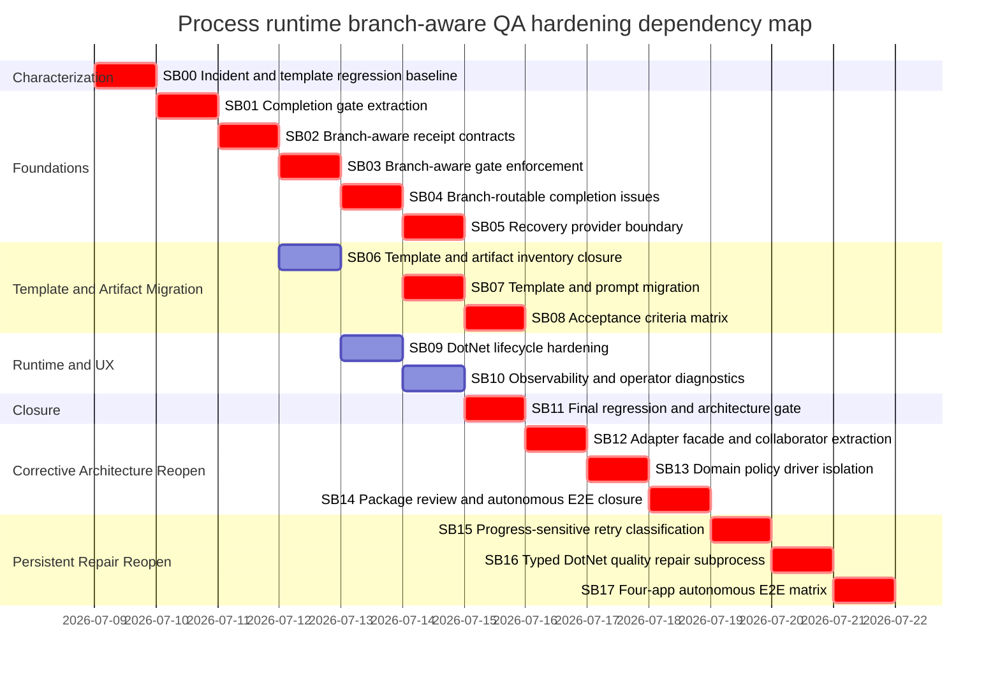

# Phase Plan

## Execution Order

1. SB00 establishes failing-first incident and template-surface characterization.
2. SB01 extracts completion gate services without behavior change.
3. SB02 introduces branch-aware receipt rule contracts and parser compatibility.
4. SB03 applies branch-aware gate enforcement and deduplicates receipt diagnostics.
5. SB04 adds template-driven branch-routable completion issues and runtime gate findings.
6. SB05 moves domain recovery advice behind providers and enforces generic boundary tests.
7. SB06 audits every similar process/template/artifact surface and records migration/exemption decisions.
8. SB07 migrates process templates and step prompts.
9. SB08 adds project-structure acceptance criteria matrix artifacts and validation flow.
10. SB09 hardens .NET runtime run/stop lifecycle receipts.
11. SB10 adds observability/operator diagnostics and UI trace summaries.
12. SB11 runs final integration regression, CodeAnalytics review, and raw-note closure.
13. SB12 reopens the failed SB01 architecture premise, replaces the adapter partial cluster with a thin boundary plus cohesive top-level collaborators, and proves independent tests.
14. SB13 extracts .NET/software-delivery receipt and recovery semantics behind explicit policy contributions so generic completion code is domain-neutral.
15. SB14 reviews OpenAI package compatibility, runs final architecture gates, and performs an autonomous Tetris production-path E2E observation when prerequisites are available.
16. SB15 adds generic persistent-diagnostic progress classification so an unchanged blocker receives at most one blind current-step retry.
17. SB16 replaces direct software-delivery quality repair with a typed .NET repair subprocess that separates diagnosis, mutation, independent QA, bughunt, and bounded re-repair.
18. SB17 rebuilds 5032 and proves autonomous behavior across Tetris, Calculator, a work-time logger, and an SVG-heavy app, reopening SB15 or SB16 for every product-caused escalation.

## Subbundle Dependency Map

## Critical Subbundles

- SB00 is critical because every later behavior change depends on the failing-first regression shape.
- SB01 is critical because later routing behavior must not remain trapped in a partial adapter monolith.
- SB02 is critical because branch-aware enforcement depends on preserving and parsing structured rule metadata.
- SB03 is critical because receipt applicability/dedup controls the repair branch loopback.
- SB04 is critical because branch-routable completion issues are the main runtime behavior fix.
- SB05 is critical because domain leaks in generic application/runtime code are an architecture blocker.
- SB07 is critical because branch routing cannot work generally without template metadata.
- SB08 is critical because it prevents shell UI acceptance for complex project structures.
- SB11 is critical because it proves all source inputs are closed and no fake separation remains.
- SB12 is critical because fresh evidence disproves the old SB01 thin-facade claim; all later closure evidence is untrusted until the partial cluster is removed.
- SB13 is critical because moving methods without removing domain branching would be fake separation.
- SB14 is critical because production-path process evidence is required to know whether escalation behavior improved outside fixtures.
- SB15 is critical because aggregate diagnostic churn currently hides an unchanged blocker and wastes agent/API budget.
- SB16 is critical because a direct mutation step cannot reliably separate evidence diagnosis, repair, and independent acceptance.
- SB17 is critical because Tetris-only success cannot prove the runtime remains generic or that the repair flow generalizes.

## Phase Gates

- Gate after preparation: run `python C:\Users\lucys\.codex\skills\candoitall-bundle-preparation\scripts\validate_bundle.py <bundle> --profile initiative --stage prepared --repo-root C:\repositories\CanDoItAll`.
- Gate before each subbundle: confirm prerequisites, source references, and open reopen triggers.
- Gate after each critical subbundle: require `proof/SBxx/manifest.md`, `proof/SBxx/semantic-invariants.md`, changed-file hashes, failing-first and passing transcripts, source assertions, and anti-stub audit.
- Gate after SB04: do not migrate dependent templates until branch routing and runtime gate findings are proved.
- Gate after SB05: run architecture forbidden-token tests before dependent template work is accepted.
- Gate after SB08: prove Calculator-like criteria remain lightweight and Tetris-like shell implementation fails.
- Gate before closure: run unit tests, build, CodeAnalytics dependency/cycle proof, template inventory closure, and raw input note closure.
- Gate after SB12: source scan must find exactly one non-partial adapter declaration; direct tests instantiate extracted collaborators without the adapter.
- Gate after SB13: generic runtime/dispatcher/completion scans must reject .NET/software-delivery literals while domain contributors retain positive behavior.
- Gate before SB14 E2E: preserve the Tetris workflow input artifact, remove only prior run output/artifacts, clear `C:\programovani\dotnet\output`, and pass launch preflight.
- Gate after SB15: arbitrary diagnostic fixtures prove one repeated blocker routes to manager after one retry even when unrelated diagnostics are added or removed; genuine diagnostic replacement still receives the bounded global retry budget.
- Gate after SB16: `quality-repair` is runtime-owned, parent code only launches/observes the child, the child has separate diagnosis/mutation/QA roles, and no generic runtime/application file contains .NET or software-delivery literals.
- Gate before every SB17 run: remove only run-generated project projections, preserve workflow/source inputs, verify the exact external output target under `C:\programovani\dotnet\output`, and pass launch preflight before launch.
