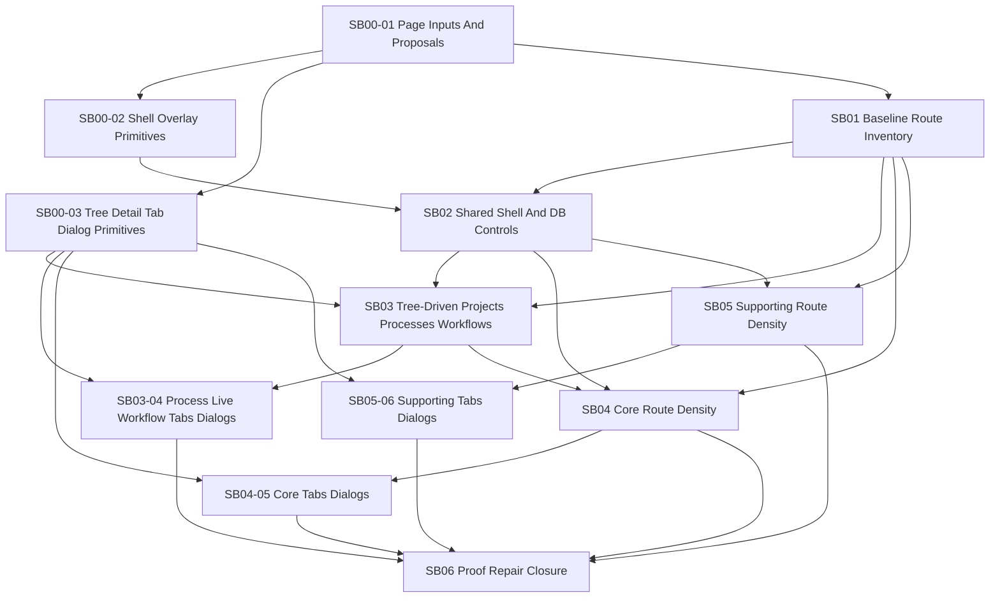

# Phase Plan

## Execution Order

| Order | Subbundle | Purpose | Critical |
|---|---|---|---|
| 1 | SB00-01 page-function inputs and imagegen proposals | Maintain real page/tab/dialog inputs and accepted proposal coverage. | Yes |
| 2 | SB00-02 BaseLib desktop shell and overlay primitives | Build reusable collapsed rail, tooltip, bottom utility, and safe flyout primitives. | Yes |
| 3 | SB00-03 BaseLib tree/detail/tab/dialog primitives | Build reusable dense workspace, TreeView/detail, tab, dialog, metric, and toolbar patterns. | Yes |
| 4 | SB01 design baseline, imagegen, and route inventory | Capture large-screen runtime baselines and keep route inventory aligned with page inputs. | Yes |
| 5 | SB02 shared shell navigation and database controls | Wire collapsed shell, bottom Settings/DB actions, DB flyout, and topbar DB removal. | Yes |
| 6 | SB03 tree-driven project, process, and workflow surfaces | Convert major hierarchical surfaces to TreeView/list-detail navigation. | Yes |
| 7 | SB03-04 process, live, workflow tabs and dialogs | Redesign process/live/workflow tab bodies and dialogs. | Yes |
| 8 | SB04 core workspace page density pass | Refresh dashboard, agents, resources, plugins, prompts, prompt factory, and settings route-level layouts. | No |
| 9 | SB04-05 core prompts/plugins/settings tabs and dialogs | Redesign core admin tab/dialog-heavy content. | No |
| 10 | SB05 supporting module page density pass | Refresh CRM/HR, collaboration, activity, automation, scheduler, validation, and test lab route-level layouts. | No |
| 11 | SB05-06 CRM/HR and operations tabs/dialogs | Redesign supporting module tab/dialog-heavy content. | No |
| 12 | SB06 large-screen proof, repair, and closure | Run screenshot-driven repair loop and close raw notes. | Yes |

## Subbundle Dependency Map

## Critical Subbundles

- SB00-01 is critical because the user's newest request requires every page/tab/dialog proposal to be grounded in real functions before coding starts.
- SB00-02 is critical because collapsed navigation, bottom DB controls, right-side tooltips, and safe DB flyouts affect every route.
- SB00-03 is critical because page work must reuse BaseLib/Tailwind patterns instead of inventing page-local CSS.
- SB01 is critical because browser baselines decide whether the proposals match the running app.
- SB02 is critical because shell width and database control placement are global.
- SB03 is critical because projects, processes, and workflows are the required TreeView surfaces.
- SB03-04 is critical because processes, live operations, and workflows contain the densest tabs/dialogs and are likely demo routes.
- SB06 is critical because screenshots and raw-note closure decide whether the visual refresh actually meets the B2B presentation bar.

## Phase Gates

| Subbundle | Gate before downstream work |
|---|---|
| SB00-01 | Every product route/page group, real tab body, and dialog family has a page input and accepted proposal coverage or explicit exception. |
| SB00-02 | Shared shell/overlay primitive contract supports collapsed/expanded rail, right-side tooltip, bottom utility actions, and safe flyout content. |
| SB00-03 | Shared tree/detail, dense tab, inspector dialog, metric strip, toolbar, and compact state patterns exist or have documented implementation exceptions. |
| SB01 | All route-bearing product pages have baseline screenshot/proposal rows, accepted proposal references, and explicit blockers where ids/data are missing. |
| SB02 | Large-screen shell screenshots prove collapsed rail default, expanded rail, right-side tooltips, bottom Settings/DB actions, DB flyout with copy action, and no topbar DB switch. |
| SB03 | Projects, processes, and workflows have TreeView-backed hierarchy or explicit exceptions; selection, badges, empty states, and route actions are proven. |
| SB03-04 | Process/live/workflow tab bodies and dialogs have large-screen screenshots and preserve every runtime/action flow. |
| SB04 | Core workspace routes use full-width layouts and avoid new page-local CSS; crowded route-level details are moved to dialogs/flyouts where appropriate. |
| SB04-05 | Core admin tabs/dialogs for plugins, prompt gallery, prompt factory, resources, and settings are proven or blockers are explicit. |
| SB05 | Supporting module routes pass density and full-width checks without broad unrelated rewrites. |
| SB05-06 | CRM/HR and operations tab/dialog-heavy states are proven or blockers are explicit. |
| SB06 | Execution report has populated gate rows, browser analytics, analytics review, screenshot paths, and raw-note closure statuses. |
