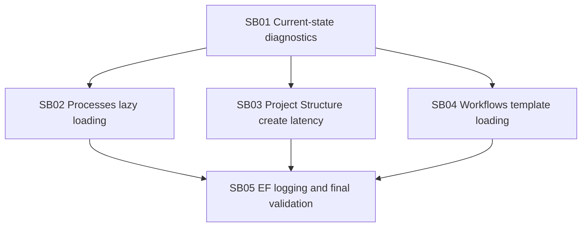

# Phase Plan

## Execution Order

1. `SB01-current-state-and-diagnostics`
2. `SB02-processes-lazy-loading`
3. `SB03-project-structure-mutation-latency`
4. `SB04-workflows-template-loading`
5. `SB05-ef-console-logging-option-and-final-validation`

## Subbundle Dependency Map

## Critical Subbundles

- `SB02` is critical for the Processes startup regression and must prove hidden-tab data is deferred.
- `SB03` is critical for the add-node canvas regression and must prove the normal create path avoids full reload.
- `SB04` is critical for Workflows startup latency and must prove template/catalog seeding is not part of page initialization.
- `SB05` is the closure gate for logging configuration and whole-app validation.

## Phase Gates

| Phase | Gate |
| --- | --- |
| `SB01` | Current eager-call sources are recorded and exact files are identified. |
| `SB02` | Processes initial load is minimal; deferred tabs/dialogs still load required data. |
| `SB03` | Add-node path locally patches the canvas after persistence and targeted test proves reduced reload work. |
| `SB04` | Workflows initialization avoids seed/catalog work and lazy tab gates preserve editor/template behavior. |
| `SB05` | EF logging option exists with default-off tests, build/test pass, web app starts. |

## Validation Commands

- `python scripts/validate_bundle.py --stage prepared`
- Targeted `dotnet test` commands for component and unit tests touched by implementation.
- `dotnet build src/CanDoItAll.Web/CanDoItAll.Web.csproj`
- Web-app startup command for `src/CanDoItAll.Web/CanDoItAll.Web.csproj`.
