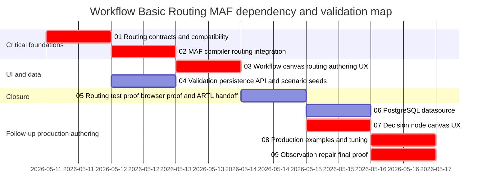

# Phase Plan

## Phase Sequence

1. Establish route domain contracts, legacy compatibility, and validation shape.
2. Compile those contracts into MAF routing primitives and prove runtime behavior.
3. Add workflow canvas authoring UX and visual route summaries.
4. Prove persistence/API round-trip and seed practical route scenarios.
5. Run final test/browser proof, complete raw-note closure, and record ARTL handoff.
6. Configure a clean PostgreSQL workflow-routing datasource and Visual Studio launch profile.
7. Improve decision block toolbox/menu placement, diamond rendering, and renderer-keyed first setup dialogs.
8. Add production-like example workflows and tuned LLM/executor settings.
9. Run 20+ scenario observations, model comparisons, browser screenshots, and repair any discovered trouble.

## Subbundle Dependency Map

## Critical Subbundles

- Subbundle 01 is critical because it defines the saved graph contract consumed by all later phases.
- Subbundle 02 is critical because UI proof is meaningless unless MAF runtime routing honors the saved routes.
- Subbundle 03 is critical because the user explicitly requested workflow canvas support.
- Subbundle 04 is not allowed to close before route metadata round-trips through persistence/API.
- Subbundle 05 is the closure gate and must reopen earlier subbundles if proof contradicts their assumptions.
- Subbundle 06 is isolated infrastructure; destructive work is restricted to the explicitly named workflow-routing PostgreSQL test database.
- Subbundle 07 is critical because it is the user-visible canvas repair and plugin-renderer preparation.
- Subbundle 08 is critical because production examples are the practical proof surface for the routing model.
- Subbundle 09 is the follow-up closure gate and must feed observed failures back into implementation or the bundle report.

## Phase Gates

- Gate after preparation: run `python3 codex/skills/bundles/candoitall-bundle-preparation/scripts/validate_bundle.py codex/bundles/workflow-basic-routing-maf --profile initiative --stage prepared` and repair failures.
- Gate before subbundle 01: confirm the current `WorkflowEdge` shape and saved-definition serializer have not changed since bundle preparation.
- Gate after subbundle 01: old definitions load; new route metadata serializes; validator detects malformed route definitions.
- Gate after subbundle 02: runtime tests prove conditional false branches are skipped, switch default is honored, and fan-out selection matches expected target indices.
- Gate after subbundle 03: browser proof shows route builder authoring, save/load, validation, and preview-run.
- Gate after subbundle 04: API and persistence integration tests prove route metadata round-trip.
- Final gate: execution report contains subbundle proof, browser analytics, raw-note closure, and ARTL handoff notes.
- Follow-up final gate: execution report contains PostgreSQL proof, decision-node screenshots, seeded workflow inventory, 20+ scenario observation logs, `gpt-5-mini`/`gptoss20b64k` comparison, and repaired-trouble notes.

## Closure Result

- Follow-up final gate passed on 2026-05-11. See `reviews/01-execution-report.md` and evidence under `reviews/evidence/subbundle-06` through `reviews/evidence/subbundle-09`.
