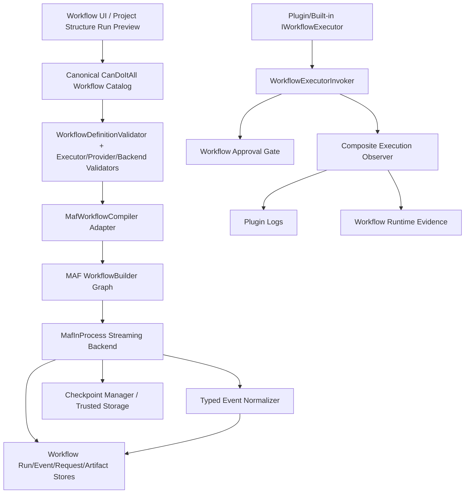

# Target solution

## Runtime layers

## Key design decisions

### Canonical model remains CanDoItAll-owned

Do not persist MAF-native workflow graphs as the product model. Continue to compile from `WorkflowDefinition` into MAF at runtime/validation boundaries.

### Use streaming for workflows that can pause or require observability

The in-process backend should use streaming execution when HITL, approval, checkpoint, or detailed event capture is enabled. A non-streaming fast path is acceptable only when it produces identical persisted final state and event semantics for simple no-HITL workflows.

### Approval is a workflow external request

Approval-required executors should not throw immediately just because a gate is needed. They should create a structured approval request that can be persisted, surfaced in UI, and answered. Denial and timeout are explicit runtime outcomes. Preview simulation may auto-deny/auto-approve only when the preview plan explicitly says so.

### Human input must be reached by execution

A human node is not a graph-wide workflow stop flag. It is a runtime step. The graph must execute until it reaches the human node or a MAF request port emits a request.

### Checkpoints are trusted infrastructure

Checkpoint storage must be private and treated as trusted. Do not load arbitrary checkpoint data from user-uploaded files. Persist metadata separately from the raw checkpoint blob and include schema/version/provenance.

### Observers are composable

Executor audit should be multicast to all registered observers. A null observer is a fallback only when no real observer exists, not a service that blocks later module registration.

### Backend catalog is honest

The UI and API must distinguish:
- registered and runnable backends,
- registered but disabled/unavailable backends,
- planned/documented backends,
- unsupported backends.

Never let a production runtime policy imply durability when only in-process execution is registered.
