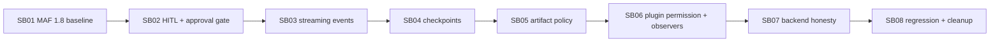

# Phase plan

## Phase gates

### Gate 0 - before any edits

- Confirm branch: `processes-hardening`.
- Capture current commit.
- Capture `git status --short`.
- Run restore/build baseline.
- Run targeted workflow/plugin tests that currently pass.
- Read previous final architecture review under `codex/bundles/workflow-maf-hardening/reviews/02-final-architecture-review.md`.

### SB01 gate

Continue only if either:
- MAF packages are upgraded and restore/build/tests pass, or
- an ADR documents exact upgrade blockers with compile errors and a temporary compatibility decision.

### SB02 gate

Continue only if:
- A workflow containing an unreachable human node no longer waits immediately.
- A workflow reaching a human/approval step creates a pending request and can complete after response.
- Approval-required Docker/Gmail/Office365 write executors remain blocked without explicit approval.

### SB03 gate

Continue only if:
- Event records include useful node/executor identity.
- Request/output/error/superstep events are represented without raw secret leakage.
- Streaming/non-streaming behavior is intentionally selected and documented.

### SB04 gate

Continue only if:
- A checkpoint abstraction exists.
- At least an in-memory or file-backed trusted implementation is wired for tests.
- Resume support is either implemented for a simple workflow or explicitly blocked behind clear API/UI state.

### SB05 gate

Continue only if:
- Large payloads are split/truncated according to policy.
- Output/tool receipt artifacts are created when policy requests capture.
- Started events no longer store unbounded raw input inline.

### SB06 gate

Continue only if:
- Plugin manifest validation catches permission/capability mismatches.
- Executor audit observer composition is order-independent.
- Fake-mode plugin tests prove no live external effects by default.

### SB07 gate

Continue only if:
- Backend catalog/API/UI cannot imply DurableTask/AzureFunctions are runnable when no backend is registered.
- Runtime policy validation reflects actual registered backend capabilities.

### SB08 gate

Close only if:
- Full relevant build/test matrix passes.
- Evidence is concise.
- Documentation and previous bundle residual risks are updated.
