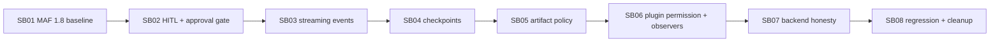

# Phase plan

## Execution Order

- SB01: MAF 1.8 baseline and API delta gate.
- SB02: HITL and approval-gate runtime.
- SB03: Streaming events and node identity.
- SB04: Checkpoint and resume foundation.
- SB05: Artifact and payload policy hardening.
- SB06: Plugin permission contract and observer composition.
- SB07: Backend catalog and production runtime honesty.
- SB08: Final regression, CI, and evidence cleanup.

## Subbundle Dependency Map

## Critical Subbundles

- SB01 is critical because all later runtime work depends on an intentional MAF API baseline.
- SB02 is critical because HITL and approval behavior determine safe execution semantics.
- SB03 is critical because event identity supports HITL, checkpoints, artifacts, audit, and UI visibility.
- SB04 is critical because checkpoint storage is a trust boundary and future resume foundation.
- SB05 is critical because it governs payload size and secret exposure across runtime evidence.
- SB06 is critical because plugin external-effect governance must be deterministic.
- SB07 is critical because users must not be told unavailable production backends are runnable.
- SB08 is critical because it closes the bundle with proof and raw-note audit.

## Phase Gates

### Gate 0 - before any edits

- Confirm branch: `processes-hardening`.
- Capture current commit.
- Capture `git status --short`.
- Run restore/build baseline.
- Run targeted workflow/plugin tests that currently pass.
- Read previous final architecture review under `codex/bundles/workflow-maf-hardening/reviews/02-final-architecture-review.md`.

### SB01 gate

Continue only if either:
- MAF packages are upgraded and restore/build/tests pass, or
- an ADR documents exact upgrade blockers with compile errors and a temporary compatibility decision.

### SB02 gate

Continue only if:
- A workflow containing an unreachable human node no longer waits immediately.
- A workflow reaching a human/approval step creates a pending request and can complete after response.
- Approval-required Docker/Gmail/Office365 write executors remain blocked without explicit approval.

Result: `Passed`. See `bundle://proof/SB02/manifest.md`.

### SB03 gate

Continue only if:
- Event records include useful node/executor identity.
- Request/output/error/superstep events are represented without raw secret leakage.
- Streaming/non-streaming behavior is intentionally selected and documented.

Result: `Passed`. See `bundle://proof/SB03/manifest.md`.

### SB04 gate

Continue only if:
- A checkpoint abstraction exists.
- At least an in-memory or file-backed trusted implementation is wired for tests.
- Resume support is either implemented for a simple workflow or explicitly blocked behind clear API/UI state.

Result: `Passed`. See `bundle://proof/SB04/manifest.md`.

### SB05 gate

Continue only if:
- Large payloads are split/truncated according to policy.
- Output/tool receipt artifacts are created when policy requests capture.
- Started events no longer store unbounded raw input inline.

Result: `Passed`. See `bundle://proof/SB05/manifest.md`.

### SB06 gate

Continue only if:
- Plugin manifest validation catches permission/capability mismatches.
- Executor audit observer composition is order-independent.
- Fake-mode plugin tests prove no live external effects by default.

Result: `Passed`. See `bundle://proof/SB06/manifest.md`.

### SB07 gate

Continue only if:
- Backend catalog/API/UI cannot imply DurableTask/AzureFunctions are runnable when no backend is registered.
- Runtime policy validation reflects actual registered backend capabilities.

Result: `Passed`. See `bundle://proof/SB07/manifest.md`.

### SB08 gate

Close only if:
- Full relevant build/test matrix passes.
- Evidence is concise.
- Documentation and previous bundle residual risks are updated.

Result: `Passed`. See `bundle://proof/SB08/manifest.md`.
