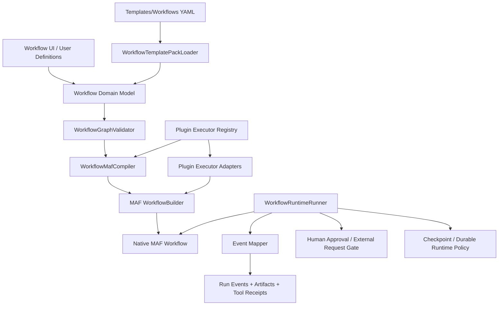

# Target Solution

## Architectural direction

Keep CanDoItAll's workflow definition model as the canonical storage and UI model, but introduce a strict native-MAF execution boundary. The boundary should validate and compile/adapt a repository `WorkflowDefinition` into a MAF workflow using typed executor adapters. Plugins must register executor descriptors and factories through a central registry; they must not execute as arbitrary side effects from UI/services.

## Layered model



## Core contracts to introduce or verify

Names are suggestions. Codex should reuse existing abstractions when they already exist and only introduce new contracts when there is no clean equivalent.

```csharp
public interface IWorkflowDefinitionValidator
{
    WorkflowValidationResult Validate(WorkflowDefinition definition, WorkflowExecutorRegistrySnapshot executors);
}

public interface IWorkflowMafCompiler
{
    WorkflowCompilationResult Compile(WorkflowDefinition definition, WorkflowCompilationOptions options);
}

public interface IWorkflowExecutorRegistry
{
    IReadOnlyCollection<WorkflowExecutorDescriptor> ListExecutors();
    WorkflowExecutorDescriptor? Find(WorkflowExecutorId executorId);
    IWorkflowExecutorAdapter CreateAdapter(WorkflowExecutorId executorId, WorkflowExecutorActivationContext context);
}

public interface IWorkflowRuntimeRunner
{
    Task<WorkflowRunResult> RunAsync(WorkflowRunRequest request, CancellationToken cancellationToken);
    IAsyncEnumerable<WorkflowRunEvent> RunStreamingAsync(WorkflowRunRequest request, CancellationToken cancellationToken);
}
```

## Typed message boundary

Persisted templates may remain JSON-based, but native MAF execution should use a deliberate typed payload envelope:

```csharp
public sealed record WorkflowJsonMessage(
    WorkflowRunId RunId,
    WorkflowNodeId CurrentNodeId,
    JsonDocument Payload,
    WorkflowMessageMetadata Metadata);
```

This avoids hiding unvalidated `object` payloads throughout the runtime while preserving JSON flexibility for template-authored workflows.

## Plugin executor descriptor shape

```csharp
public sealed record WorkflowExecutorDescriptor(
    WorkflowExecutorId Id,
    string DisplayName,
    string ProviderKey,
    WorkflowExecutorCapabilityFlags Capabilities,
    WorkflowValueShape InputShape,
    WorkflowValueShape OutputShape,
    WorkflowExecutorExecutionPolicy DefaultPolicy,
    WorkflowExecutorPermissionPolicy PermissionPolicy,
    string SettingsSchemaJson,
    bool RequiresHumanApprovalByDefault,
    bool SupportsDeterministicTestMode);
```

## Runtime guarantees

- Graph validation happens before persistence when possible and always before execution.
- Compilation/adaptation to MAF is deterministic and covered by golden tests.
- Preview runs use in-process execution only when policy allows it.
- Production runs require durable runtime when policy requires it.
- Plugin executor invocation applies permissions, approval, timeout, retry, cancellation, redaction, and artifact capture.
- Events from MAF and plugin adapters are normalized to repository run events.
- User-managed workflow definitions survive template seed refreshes and migrations.
