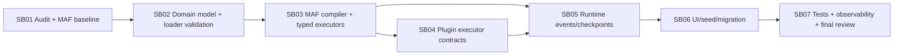

# Phase Plan

## Execution Order

1. SB01 repo-local inventory and MAF version baseline.
2. SB02 workflow domain model and template loader hardening.
3. SB03 MAF workflow compiler and executor foundation.
4. SB04 plugin executor contract and sandbox hardening.
5. SB05 runtime events, state, and checkpoint alignment.
6. SB06 agent workflow UI, seeding, and compatibility migration.
7. SB07 tests, observability, and final hardening review.

## Subbundle Dependency Map



## Critical Subbundles

- SB02 is a critical foundation because every compiler, runtime, UI, and seed path depends on validated canonical workflow graphs.
- SB03 is a critical foundation because downstream plugin and runtime work must execute through a single native MAF adapter boundary.
- SB04 is a critical foundation because plugin executors are external-effect runtime components and must be permissioned, cancellable, and deterministic.
- SB05 is a critical foundation because runtime state, events, checkpoint policy, and artifacts are the durable audit surface for workflow execution.
- SB06 is critical for data safety because seed refresh and compatibility migration must preserve user-managed workflow definitions.

## Phase Gates

| Gate | Required proof | May proceed when |
| --- | --- | --- |
| G01 | Local inventory, package baseline, restore/build attempt | SB01 report is complete and blockers are explicit. |
| G02 | Graph validator tests and template-pack compile tests | Invalid templates fail early with clear diagnostics. |
| G03 | Native MAF compiler/adapter tests | Repository graphs can build MAF workflows deterministically. |
| G04 | Plugin fake executor tests | Plugin executors obey schema, policies, cancellation, approvals, and artifacts. |
| G05 | Runtime event/checkpoint tests | Preview vs durable policy and event/artifact mapping are proven. |
| G06 | UI/seed/migration tests | User-managed definitions are preserved and UI reflects new contracts. |
| G07 | Full validation suite and architecture review | No critical gaps remain undocumented. |

## Rollback Strategy

- SB01: no functional edits; rollback unnecessary except report corrections.
- SB02: graph validation can initially be warning-only behind a feature flag if existing data contains invalid definitions; final gate should move to blocking for new/edited definitions.
- SB03: keep the old preview path temporarily behind an internal compatibility flag only until MAF compiler proof passes.
- SB04: plugin executors may start as adapters around existing plugin services, but policies must be enforced at the adapter boundary.
- SB05: production durable enforcement may be staged, but the UI/API must not label in-process preview as durable production.
- SB06: migrations must be idempotent and reversible where feasible.

## Recommended validation commands

Run commands from repository root and capture outputs under the bundle `proof/` tree.

```powershell
dotnet restore CanDoItAll.slnx
dotnet build CanDoItAll.slnx --no-restore

dotnet test tests/CanDoItAll.Tests.Unit/CanDoItAll.Tests.Unit.csproj --filter "FullyQualifiedName~Workflow|FullyQualifiedName~AgentFramework|FullyQualifiedName~Plugin"
dotnet test tests/CanDoItAll.Tests.Integration/CanDoItAll.Tests.Integration.csproj --filter "FullyQualifiedName~Workflow|FullyQualifiedName~Plugin"
```

When UI changes are made:

```powershell
dotnet test tests/CanDoItAll.Tests.Playwright/CanDoItAll.Tests.Playwright.csproj --filter "FullyQualifiedName~Agents|FullyQualifiedName~Workflows|FullyQualifiedName~Plugins"
```

If these exact filters do not match current test names, Codex must record the mismatch and run the closest equivalent targeted tests.
