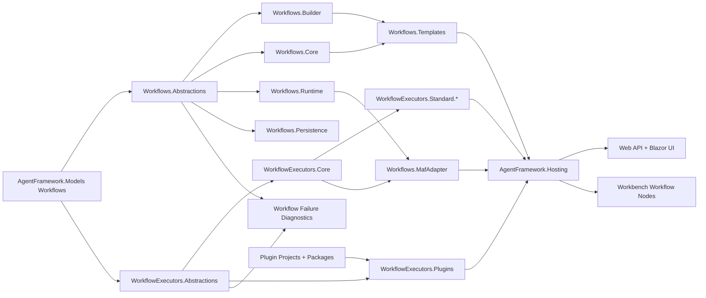

# Target Solution

## Target Architecture

The end state is a workflow platform that MAF consumes, not a workflow platform hidden inside MAF.

## Proposed Projects

| Project | Purpose | Dependency rule |
| --- | --- | --- |
| `CanDoItAll.AgentFramework.Workflows.Abstractions` | Workflow catalog/runtime/store contracts, event contracts, run/checkpoint/artifact/external request abstractions, validation result contracts, failure diagnostic contracts, and composition contracts. | References Models only. No Core, MAF, Web, Modules, or plugin implementation references. |
| `CanDoItAll.AgentFramework.Workflows.Builder` | Strongly typed builders/factories for workflow definitions, graphs, nodes, edges, ports, test fixtures, and template-to-model construction helpers. | References Models and Workflows.Abstractions. |
| `CanDoItAll.AgentFramework.Workflows.Core` | Definition validator, routing compiler, catalog services, payload policy, diagnostic formatter, preview simulation renderer, process executor bridge contracts that do not need MAF. | References Workflows.Abstractions, Builder, Models, and minimal shared services. |
| `CanDoItAll.AgentFramework.Workflows.Runtime` | Runtime manager, backend catalog, external request capture, in-memory run store, event sink defaults, checkpoint factory, artifact content abstractions, and failure-event persistence policy. | References Workflows.Abstractions/Core and executor abstractions. No MAF. |
| `CanDoItAll.AgentFramework.Workflows.Persistence` | Durable workflow stores, run/checkpoint/artifact persistence adapters, runtime evidence source provider. | References Workflows.Abstractions/Runtime and persistence primitives. No UI. |
| `CanDoItAll.AgentFramework.Workflows.Templates` | `Templates/Workflows` manifest/workflow YAML models, loader, validation, input parameter materialization, descriptor-aware template checks. | References Workflows.Builder/Core and executor abstractions. No Blazor module dependency. |
| `CanDoItAll.AgentFramework.WorkflowExecutors.Abstractions` | `IWorkflowExecutor`, descriptor source, executor catalog contract, invoker contract, execution context, approval gate, observability contracts, permission/side-effect contract boundaries. | References Models and Workflows.Abstractions. No implementation dependencies. |
| `CanDoItAll.AgentFramework.WorkflowExecutors.Core` | Executor catalog, invoker, redaction, payload policy, execution audit scope, failure-diagnostic adapter, settings schema helper, JSON serializer options, generated regex helpers, test harness fakes. | References executor abstractions only plus shared kernel. |
| `CanDoItAll.AgentFramework.WorkflowExecutors.Standard.Control` | Delay, human approval, planned/no-op executors. | References executor abstractions/core and workflow runtime abstractions. |
| `CanDoItAll.AgentFramework.WorkflowExecutors.Standard.Transforms` | JSON transform and markdown render helpers. | No MAF; dependencies must be narrow. |
| `CanDoItAll.AgentFramework.WorkflowExecutors.Standard.Workspace` | Workspace file, source ingestion, project-structure-adjacent source readers through narrow workspace/project interfaces. | Does not reference Workbench pages. |
| `CanDoItAll.AgentFramework.WorkflowExecutors.Standard.Network` | HTTP fetch and future network data executors with explicit permission and deterministic preview metadata. | No hidden network access; must expose side-effect, timeout, and approval policy. |
| `CanDoItAll.AgentFramework.WorkflowExecutors.Standard.Documents` | Spreadsheet/document-style executors and document serialization helpers. | Keeps document dependencies out of transform/network projects. |
| `CanDoItAll.AgentFramework.WorkflowExecutors.Standard.Media` | Image generation and future media executors with provider/tool diagnostics. | No hidden provider calls; must expose side-effect, provider, and deterministic preview metadata. |
| `CanDoItAll.AgentFramework.WorkflowExecutors.Plugins` | Plugin descriptor projection, runtime package executor wrapping, source/trust/grant availability mapping, plugin execution adapters. | References plugin abstractions and executor abstractions. No Blazor page dependency. |
| `CanDoItAll.AgentFramework.Workflows.MafAdapter` | MAF workflow compiler, in-process backend adapter, LLM component invoker, event normalizer, handoff workflow factory if still needed. | References Workflows.Runtime/Core and executor abstractions; owns Microsoft Agents workflow dependency. |
| `CanDoItAll.AgentFramework.Workflows.Hosting` | Focused DI composition methods such as `AddWorkflowRuntime`, `AddWorkflowExecutors`, `AddWorkflowTemplates`, and `AddMafWorkflowAdapter`. | Host-facing only; avoids large `AddAgentFrameworkCore` wiring blocks. |

## Hard Boundaries

- MAF must not own default executor implementations or descriptor factories after SB11/SB13.
- Plugin packages must not depend on MAF to expose workflow executors.
- Blazor modules must not own template DTOs, template validation, or graph construction.
- Workbench pages must orchestrate services, not directly encode workflow runtime rules.
- Host registration must call workflow composition methods instead of registering each workflow service manually.
- Failure diagnostics must be structured contracts, not formatter-only string parsing of exception messages.
- Moving an oversized class into a new project is not sufficient. Extraction must split parsing, settings validation, IO/provider calls, result shaping, and diagnostic mapping when a source file already mixes those responsibilities.

## Compatibility Invariants

- Existing `WorkflowExecutorId` values remain stable.
- Existing `WorkflowNodeKind` behavior remains stable.
- Existing template YAML under `Templates/Workflows` continues to load.
- Existing API payloads continue to deserialize.
- Existing persisted run/checkpoint/artifact records remain readable.
- Existing plugin descriptors and runtime packages remain visible with correct source/trust/availability metadata.
- Run Preview simulation remains deterministic and side-effect-free.
- Production executor side effects remain explicit through permission and side-effect descriptors.
- Workflow failure events remain actionable and repairable: node id, executor id, source/plugin/package/tool context, retryability, repair hint, and redacted technical details must survive runtime, plugin, UI, and API boundaries.
