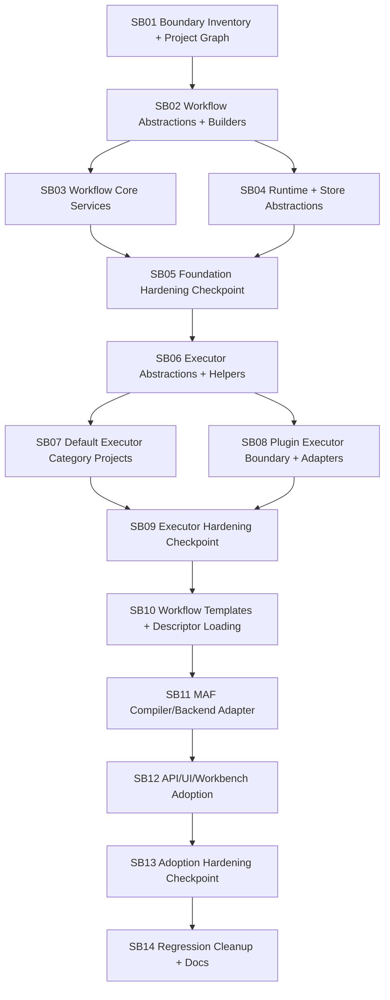

# Phase Plan

## Phase Sequence

1. SB01 confirms the inventory, project graph, dependency rules, compatibility constants, and current-state evidence.
2. SB02 creates workflow abstractions plus workflow builders/factories before services move.
3. SB03 extracts workflow core services into workflow-owned projects.
4. SB04 extracts runtime/store abstractions and implementations.
5. SB05 hardens the workflow foundation before executors and templates consume it.
6. SB06 creates executor abstractions and shared helpers.
7. SB07 moves default executors into logical category projects.
8. SB08 migrates plugin executor descriptors, adapters, bundled executors, and runtime package compatibility.
9. SB09 hardens executor/plugin behavior before templates and MAF adoption.
10. SB10 moves workflow template loading and descriptor materialization.
11. SB11 isolates MAF compiler/backend adapter and reconnects runtime composition.
12. SB12 adopts isolated workflow services in API, Blazor workflow UI, and Workbench workflow nodes.
13. SB13 hardens adoption boundaries, diagnostics, and performance before final cleanup.
14. SB14 runs regression proof, removes obsolete paths, and documents conventions.

## Subbundle Dependency Map

## Critical Subbundles

- SB01 is critical because false inventory or a wrong project graph invalidates every downstream phase.
- SB02 is critical because all later services and tests depend on stable workflow contracts and builders/factories.
- SB03 is critical because validator/catalog/routing behavior decides whether existing definitions and templates remain valid.
- SB04 is critical because run/checkpoint/artifact/external request behavior underpins runtime proof and persistence compatibility.
- SB05 is a forced refactoring-hardening checkpoint and blocks executor work.
- SB06 is critical because executor contracts, invoker, catalog, observability, side-effect policy, and shared helpers underpin all executor implementations.
- SB08 is critical because plugins are a major executor source and can break installed packages, external side effects, grants, OAuth, and host commands.
- SB09 is a forced refactoring-hardening checkpoint and blocks templates/MAF adoption.
- SB11 is critical because it reconnects MAF and must prove MAF is an adapter, not the workflow owner.
- SB13 is a forced refactoring-hardening checkpoint and blocks final cleanup.
- SB14 is closure-critical because it proves regression behavior across workflows, plugins, UI, Workbench, API, templates, and process integration.

## Phase Gates

- Gate after preparation: run `validate_bundle.py --stage prepared` and repair failures.
- Gate before SB02: SB01 inventory and project graph must cite real source files and update XLSX mapping.
- Gate before SB03/SB04: SB02 must pass contract/builders unit tests, boundary tests, and base diagnostic-envelope serialization tests.
- Gate before SB06: SB03, SB04, and SB05 must pass foundation hardening, including no MAF references in workflow abstractions, typed failure payload compatibility, no generic runtime/validation errors, and no large unreviewed moved files.
- Gate before SB10: SB06, SB07, SB08, and SB09 must prove executor descriptor parity, plugin compatibility, deterministic preview, side-effect policy behavior, plugin/external failure diagnostics, retryability classification, redaction, and no generic executor/plugin/tool errors.
- Gate before SB12: SB10 and SB11 must prove templates load through isolated services, template failures include file/key/node/executor context, and MAF compiler/backend/tool/MCP adapter failures run through workflow runtime diagnostic contracts.
- Gate before SB14: SB12 and SB13 must prove API/UI/Workbench adoption, diagnostic quality, repair-hint display, browser proof, file-size/responsibility checks, and no hidden fallback to old paths.
- Gate before final closure: run full planned unit/integration/component/Playwright subsets, update proof manifests, run completed-stage validator, and close raw requirements.

## Validation Matrix

| Phase | Unit | Integration | UI/Component | Browser/E2E |
| --- | --- | --- | --- | --- |
| SB01 | architecture inventory guard tests | N/A | N/A | N/A |
| SB02 | abstractions/builders/factories/boundary/diagnostic-envelope tests | template fixture smoke | N/A | N/A |
| SB03 | validator/catalog/routing/payload/diagnostic tests | workflow definition import/export smoke | N/A | N/A |
| SB04 | runtime/store/checkpoint/artifact/failure-event tests | run lifecycle and partial-persistence smoke | N/A | N/A |
| SB05 | boundary, file-size, no-generic-error, diagnostics, performance scan tests | service composition smoke | N/A | N/A |
| SB06 | executor catalog/invoker/redaction/policy/retryability tests | executor composition smoke | N/A | N/A |
| SB07 | per-category executor parity and failure matrix tests | default executor run/preview/failure smoke | N/A | N/A |
| SB08 | plugin descriptor/grant/source/side-effect/diagnostic tests | plugin catalog/package/bundled executor failure smoke | plugin executor display smoke later | N/A |
| SB09 | executor/plugin hardening, no-generic-error, and performance tests | plugin/default executor composition and negative smoke | N/A | N/A |
| SB10 | template loader/materializer/diagnostic tests | template pack load + descriptor validation + malformed-template smoke | N/A | N/A |
| SB11 | MAF adapter compile/backend/tool-diagnostic tests | workflow run through adapter and failure smoke | N/A | N/A |
| SB12 | API/workbench service and error-contract tests | workflow API and project-structure scenario tests | bUnit workflow/plugin diagnostic display | Playwright workflow and workbench success/failure paths |
| SB13 | architecture, diagnostics, no-fallback, file-size, performance guard tests | adoption composition and negative smoke | focused UI regression | focused browser proof |
| SB14 | cleanup guards, no-generic-error audit, and final unit subset | final integration subset | final component subset | final Playwright subset |

## Checkpoint Exit Criteria

| Checkpoint | Must prove | Blocks |
| --- | --- | --- |
| SB05 | Workflow abstractions, builders, core services, runtime/store contracts, typed diagnostics, and project references are clean; no MAF/Core catch-all growth; no generic validation/runtime failure messages; focused performance findings recorded or addressed. | SB06 |
| SB09 | Executor abstractions/helpers, default category projects, plugin adapters, runtime package compatibility, deterministic preview, side-effect descriptors, grants, redaction, retryability, plugin/tool diagnostics, and no-generic-error assertions are correct; no executor logic remains hidden in MAF. | SB10 |
| SB13 | MAF adapter, API, UI, Workbench, templates, host composition, and tests consume isolated projects; UI/API displays repairable failure details; no hidden fallback to old workflow paths; focused browser, file-size/responsibility, and performance proof captured. | SB14 |
