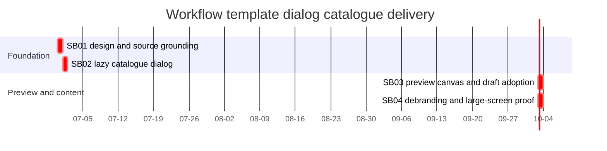

# Phase Plan

## Phase Sequence

1. SB01: Close design/current-state grounding and confirm exact source/test references.
2. SB02: Remove Templates tab, add lazy-loaded catalogue dialog, and prove templates do not load until the dialog opens.
3. SB03: Add preview canvas dialog and "Add to my drafts" behavior with deterministic conflict prefixes.
4. SB04: Debrand SEAMARK templates, update tests, run large-screen browser proof, compare screenshots to proposals, and close the bundle.

## Subbundle Dependency Map

## Critical Subbundles

- `SB01` is a critical planning foundation because later UI proof must compare against its proposal artifacts and source inventory.
- `SB02` is a critical UI/data-loading foundation because SB03 depends on a dialog-owned loaded template pack.
- `SB03` is a critical behavior foundation because it persists user-owned draft data.
- `SB04` is a critical closure subbundle because it removes sensitive template wording and validates the finished UI.

## Phase Gates

- Gate after preparation: `scripts/validate_bundle.py --stage prepared` plus manual bundle-readiness audit.
- Gate before SB02: SB01 proposal artifacts and source inventory exist; no feature code has been changed outside planned scope.
- Gate before SB03: SB02 proves the catalogue opens, loads lazily, and exposes selected templates.
- Gate before SB04: SB03 proves preview and draft adoption, including `01`/`02` naming.
- Gate before closure: component/unit tests, build, Playwright large-screen screenshots, screenshot comparison notes, raw-note closure, and completed-stage validator all pass.

## Large-Screen UI Proof Policy

- Required viewport: at least `1600x900`; prefer `1800x1100` if local browser can fit.
- Required open states: catalogue dialog and preview dialog.
- Explicitly skip small and medium screens because the user stated the app is large-screen-only.
