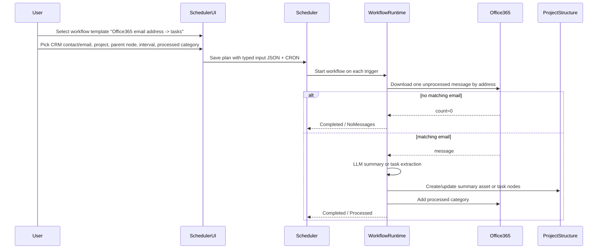

# Scheduler Email Watch Flow

## Key detail

The category mark must happen after the project write. If project write fails, the email stays unprocessed and can be retried. Idempotency must prevent duplicate project writes on retry.
