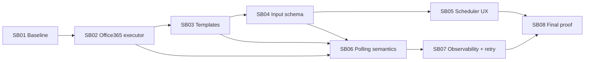

# Phase Plan

## Execution Order

- SB01: Baseline and regression proof.
- SB02: Office365 address/unprocessed message executor and add-only category mutation.
- SB03: Office365 summary/task workflow templates.
- SB04: Scheduler workflow input contract and template parameter schema.
- SB05: Scheduler CRM/email/project/node picker UX.
- SB06: No-message and idempotent scheduled polling semantics.
- SB07: Scheduler observability, retry, and approval/preapproval policy.
- SB08: Final fake Graph scenario harness and browser proof.

## Subbundle Dependency Map

## Critical Subbundles

- SB01 is critical because later proof is untrustworthy if the current executor catalog and Scheduler baseline are unstable.
- SB02 is critical because all later workflows depend on correct address matching, processed-category exclusion, no-message output, and add-only category mutation.
- SB03 is critical because it controls write-before-mark ordering and template discoverability.
- SB04 is critical because Scheduler typed input must persist through template loading and saved workflow definitions.
- SB05 is critical because the user-requested Scheduler setup must be possible without hand-writing JSON.
- SB06 is critical because recurring runs can otherwise duplicate project outputs or misclassify empty polls as failures.
- SB07 is critical because retry and approval semantics govern external Office365 writes from unattended schedules.
- SB08 is critical because it verifies the full scenario, raw-note closure, and browser-visible behavior.

## Phase Gates

### Gate 0 - before implementation

- Confirm branch, commit, and dirty working tree state.
- Run prepared-stage bundle validator after metadata repair.
- Capture baseline restore/build/test status under `bundle://proof/SB01/`.

### SB01 gate

- Continue only if existing workflow executor catalog behavior remains stable or failures are documented as pre-existing blockers.
- Continue only if missing Office365-by-address and Scheduler typed-input capabilities are represented as failing-first evidence.

### SB02 gate

- Continue only if fake Graph tests prove one-message, processed-category exclusion, no-message success, bounded fallback, and add-only category mutation.
- Downstream templates must not start if the executor omits `office365Processing`, `projectId`, `nodeId`, or idempotency context.

### SB03 gate

- Continue only if both workflow templates load through the manifest, no-message branches skip LLM/project/category writes, project writes precede category mutation, and scenario tests cover summary and tasks.

### SB04 gate

- Continue only if template `inputParameters` map into a strongly typed schema, saved workflow definitions preserve descriptors, Scheduler resolves the schema, and invalid required values prevent save.

### SB05 gate

- Continue only if `/scheduler` can configure the Office365 email-watch scenario using typed fields and option providers while preserving raw JSON fallback.
- Browser proof must cover desktop and narrow viewports.

### SB06 gate

- Continue only if retries after category-mark failure do not duplicate summary assets or task nodes and no-message runs are successful no-action runs.

### SB07 gate

- Continue only if Scheduler history and retry policy distinguish processed, no-message, failure, and waiting-for-approval outcomes.
- Continue only if Office365 category mutation approval/preapproval remains explicit, scoped, and auditable.

### SB08 gate

- Close only if restore, build, targeted unit/integration/component tests, fake Graph scenario harness, browser proof, proof manifests, raw-note closure, and completed-stage bundle validator pass or record honest blockers.

