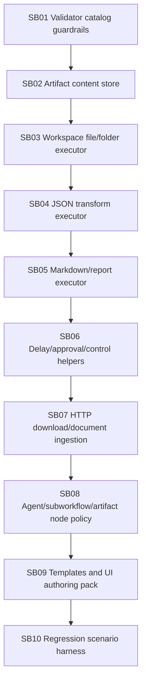

# Phase Plan

## Gate rules

- SB01 is mandatory before all executor expansion.
- SB02 is mandatory before any new executor claims artifact output.
- SB03 should produce practical local folder/file workflows.
- SB04/SB05 should remove the need to use LLMs for deterministic JSON/Markdown tasks.
- SB06 must not implement unsafe host command execution.
- SB07 must not bypass network or workspace safety.
- SB08 must prevent runtime pass-through surprises.
- SB09 must seed examples without overwriting user-managed definitions.
- SB10 must run restore/build and targeted unit/integration/component tests.

## Validation commands Codex should run

Adjust project/test filters to the current repo, but capture proof for:

- `dotnet restore CanDoItAll.slnx`
- `dotnet build CanDoItAll.slnx --no-restore`
- unit tests for workflow validator/executors/payload/artifacts
- integration tests for workflow API and persistent stores
- component tests for Workflows page/canvas executor catalog
- scenario harness for local folder -> ingest -> transform -> markdown -> write output
