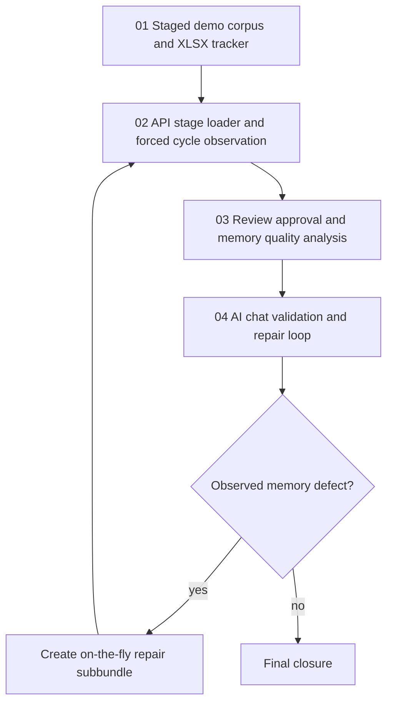

# Phase Plan

## Phase Sequence

1. Verify the staged corpus, source manifest, and XLSX tracker.
2. Create a fresh PostgreSQL validation database and load stage 1 through APIs.
3. Force ingestion/consolidation, observe snapshots, review candidates, approve/reject items, and record duplicate/contradiction decisions.
4. Repeat the load/force/observe/review cycle for stages 2, 3, and 4.
5. Run backward memory-quality analysis from approved records back to tracker rows and source files.
6. Run AI chat probes for each project and stage.
7. Create and execute repair subbundles for discovered memory defects.
8. Run final closure, update execution report, and validate the completed bundle.

## Subbundle Dependency Map

## Critical Subbundles

- Subbundle 01 is a critical data foundation because all later source-reference and quality analysis depends on its manifest and XLSX tracker.
- Subbundle 02 is a critical execution foundation because cycle evidence is meaningless unless each stage is loaded through APIs and forced through the same PostgreSQL-backed memory pipeline.
- Subbundle 03 is a critical quality gate because review approval, duplicate, and contradiction decisions define what chat validation should later retrieve.
- Subbundle 04 is a critical closure gate because it proves whether memory is useful to an AI agent, not merely present in tables.

## Phase Gates

- Gate after preparation: `validate_bundle.py --profile initiative --stage prepared` must pass.
- Gate after Subbundle 01: the workbook opens, includes all 24 source rows, and has no formula/import errors.
- Gate after each stage in Subbundle 02: API evidence confirms source upload, project asset updates where applicable, forced ingestion/consolidation, and snapshots before review.
- Gate after Subbundle 03: every approved, rejected, duplicate, contradiction, or needs-changes decision is tied to a source row and candidate preview.
- Gate before Subbundle 04: memory quality analysis shows no unresolved wrong-source or cross-project leakage defect.
- Gate during Subbundle 04: any failed chat probe must either be repaired through a new subbundle or recorded as an honest blocker with proof.
- Gate before final closure: completed-stage validator passes and `reviews/01-execution-report.md` contains raw-note closure, stage analytics, chat scoring, and repair-subbundle status.
