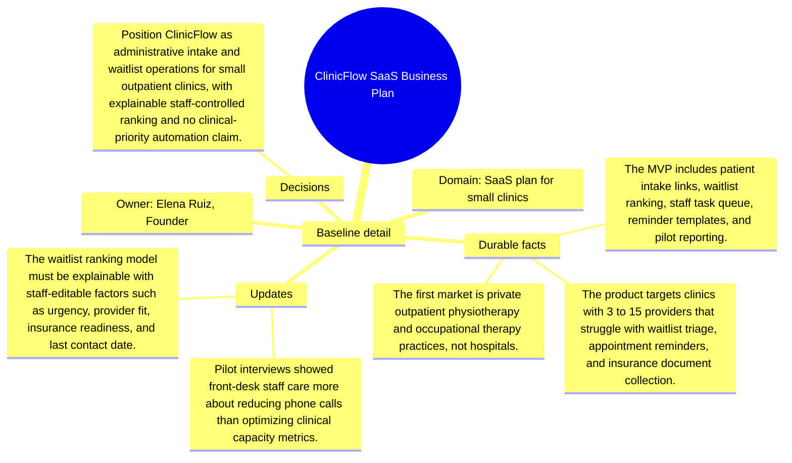

# Baseline detail: ClinicFlow SaaS Business Plan

Source package: clinicflow-saas-s01
Project domain: SaaS plan for small clinics
Named owner: Elena Ruiz, Founder
Intended ingestion: external Markdown file plus Markdown asset node in project structure
Expected consolidation behavior: create source-backed candidate memories for durable context, actors, risks, and boundaries.

## Project Context

ClinicFlow SaaS Business Plan is a demo project used to evaluate whether Cognitive Memory stores source-grounded, useful memories rather than shallow or duplicated chunks. The source should be treated as a project-scoped document. It is not a generic article, and it should not be recalled for unrelated demo projects.

## Durable Facts To Preserve

- The product targets clinics with 3 to 15 providers that struggle with waitlist triage, appointment reminders, and insurance document collection.
- The MVP includes patient intake links, waitlist ranking, staff task queue, reminder templates, and pilot reporting.
- The first market is private outpatient physiotherapy and occupational therapy practices, not hospitals.
- Pricing starts with a low per-location platform fee plus per-provider seats; enterprise contracting is explicitly out of MVP scope.
- Compliance posture requires consent tracking, minimum necessary data display, audit logs, and clear deletion workflow.

## Initial Validation Questions

- What is the canonical source of truth or governing boundary for this project?
- Which risks should be remembered as durable project risks?
- Which details should be summarized as project-specific context instead of global knowledge?
- Which facts must be attached to this source file and not to another project?

## Mindmap

## Expected Memory Behavior

The first memory cycle should create a small set of focused memories: one project overview, two to four specific operational memories, and any high-risk boundary that should require review. It should not create one memory per sentence, and it should not merge this project with similarly named sources from other projects.
