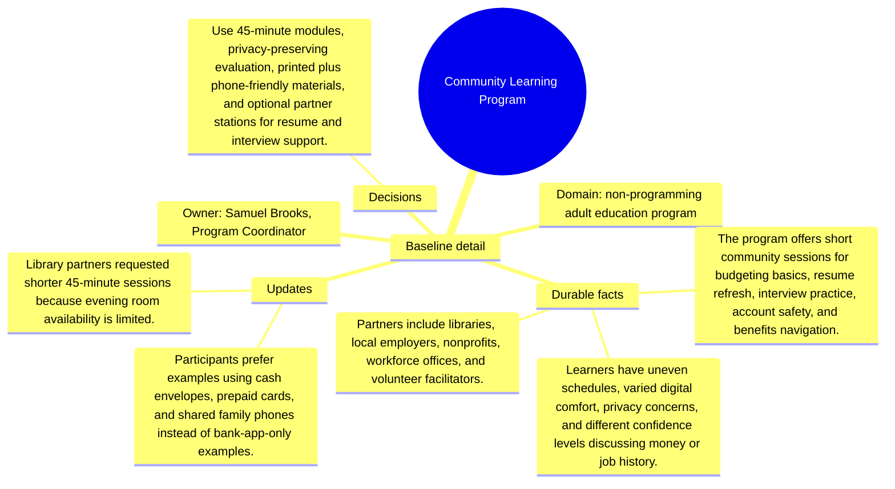

# Baseline detail: Community Learning Program

Source package: community-learning-s01
Project domain: non-programming adult education program
Named owner: Samuel Brooks, Program Coordinator
Intended ingestion: external Markdown file plus Markdown asset node in project structure
Expected consolidation behavior: create source-backed candidate memories for durable context, actors, risks, and boundaries.

## Project Context

Community Learning Program is a demo project used to evaluate whether Cognitive Memory stores source-grounded, useful memories rather than shallow or duplicated chunks. The source should be treated as a project-scoped document. It is not a generic article, and it should not be recalled for unrelated demo projects.

## Durable Facts To Preserve

- The program offers short community sessions for budgeting basics, resume refresh, interview practice, account safety, and benefits navigation.
- Learners have uneven schedules, varied digital comfort, privacy concerns, and different confidence levels discussing money or job history.
- Partners include libraries, local employers, nonprofits, workforce offices, and volunteer facilitators.
- Delivery must be modular, plain-language, repeatable, and supported by printed handouts plus phone-friendly reminders.
- Evaluation measures attendance, confidence surveys, completed resumes, budget plans, referral follow-through, and consent boundaries.

## Initial Validation Questions

- What is the canonical source of truth or governing boundary for this project?
- Which risks should be remembered as durable project risks?
- Which details should be summarized as project-specific context instead of global knowledge?
- Which facts must be attached to this source file and not to another project?

## Mindmap

## Expected Memory Behavior

The first memory cycle should create a small set of focused memories: one project overview, two to four specific operational memories, and any high-risk boundary that should require review. It should not create one memory per sentence, and it should not merge this project with similarly named sources from other projects.
