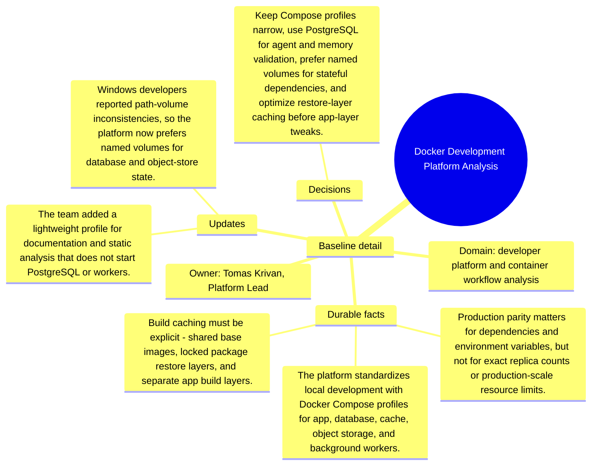

# Baseline detail: Docker Development Platform Analysis

Source package: docker-platform-s01
Project domain: developer platform and container workflow analysis
Named owner: Tomas Krivan, Platform Lead
Intended ingestion: external Markdown file plus Markdown asset node in project structure
Expected consolidation behavior: create source-backed candidate memories for durable context, actors, risks, and boundaries.

## Project Context

Docker Development Platform Analysis is a demo project used to evaluate whether Cognitive Memory stores source-grounded, useful memories rather than shallow or duplicated chunks. The source should be treated as a project-scoped document. It is not a generic article, and it should not be recalled for unrelated demo projects.

## Durable Facts To Preserve

- The platform standardizes local development with Docker Compose profiles for app, database, cache, object storage, and background workers.
- Production parity matters for dependencies and environment variables, but not for exact replica counts or production-scale resource limits.
- Build caching must be explicit: shared base images, locked package restore layers, and separate app build layers.
- CI evidence must include compose config validation, container health checks, migration dry run, and smoke request against the web app.
- Developers must be able to run only the dependencies they need instead of starting the entire product stack.

## Initial Validation Questions

- What is the canonical source of truth or governing boundary for this project?
- Which risks should be remembered as durable project risks?
- Which details should be summarized as project-specific context instead of global knowledge?
- Which facts must be attached to this source file and not to another project?

## Mindmap

## Expected Memory Behavior

The first memory cycle should create a small set of focused memories: one project overview, two to four specific operational memories, and any high-risk boundary that should require review. It should not create one memory per sentence, and it should not merge this project with similarly named sources from other projects.
