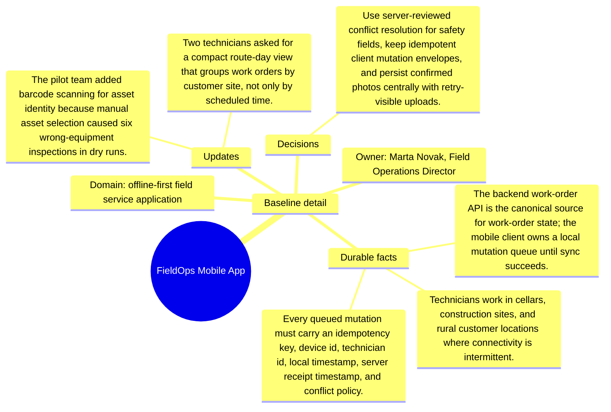

# Baseline detail: FieldOps Mobile App

Source package: fieldops-mobile-s01
Project domain: offline-first field service application
Named owner: Marta Novak, Field Operations Director
Intended ingestion: external Markdown file plus Markdown asset node in project structure
Expected consolidation behavior: create source-backed candidate memories for durable context, actors, risks, and boundaries.

## Project Context

FieldOps Mobile App is a demo project used to evaluate whether Cognitive Memory stores source-grounded, useful memories rather than shallow or duplicated chunks. The source should be treated as a project-scoped document. It is not a generic article, and it should not be recalled for unrelated demo projects.

## Durable Facts To Preserve

- Technicians work in cellars, construction sites, and rural customer locations where connectivity is intermittent.
- The backend work-order API is the canonical source for work-order state; the mobile client owns a local mutation queue until sync succeeds.
- Every queued mutation must carry an idempotency key, device id, technician id, local timestamp, server receipt timestamp, and conflict policy.
- Photo evidence is part of the inspection record and must remain retryable until the backend confirms object-storage persistence.
- Supervisor review requires a visible audit trail of changed checklist answers, rejected photos, and conflict decisions.

## Initial Validation Questions

- What is the canonical source of truth or governing boundary for this project?
- Which risks should be remembered as durable project risks?
- Which details should be summarized as project-specific context instead of global knowledge?
- Which facts must be attached to this source file and not to another project?

## Mindmap

## Expected Memory Behavior

The first memory cycle should create a small set of focused memories: one project overview, two to four specific operational memories, and any high-risk boundary that should require review. It should not create one memory per sentence, and it should not merge this project with similarly named sources from other projects.
