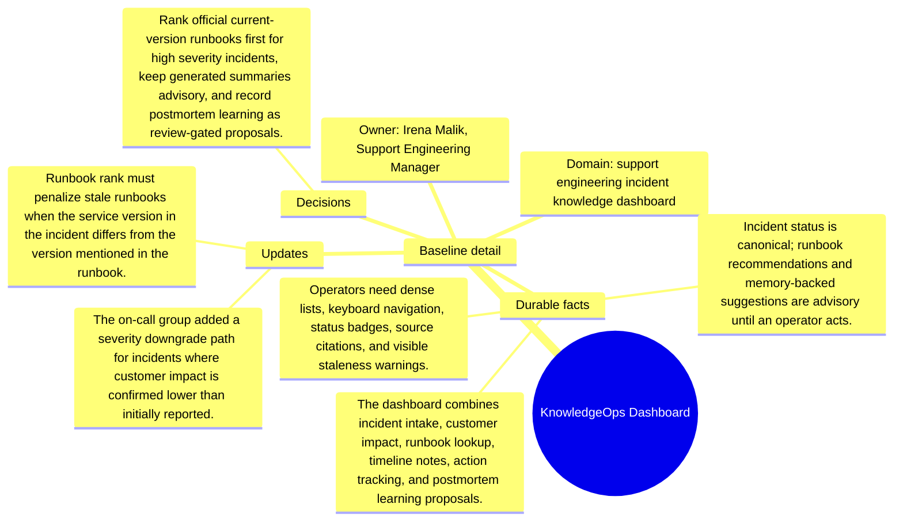

# Baseline detail: KnowledgeOps Dashboard

Source package: knowledgeops-dashboard-s01
Project domain: support engineering incident knowledge dashboard
Named owner: Irena Malik, Support Engineering Manager
Intended ingestion: external Markdown file plus Markdown asset node in project structure
Expected consolidation behavior: create source-backed candidate memories for durable context, actors, risks, and boundaries.

## Project Context

KnowledgeOps Dashboard is a demo project used to evaluate whether Cognitive Memory stores source-grounded, useful memories rather than shallow or duplicated chunks. The source should be treated as a project-scoped document. It is not a generic article, and it should not be recalled for unrelated demo projects.

## Durable Facts To Preserve

- The dashboard combines incident intake, customer impact, runbook lookup, timeline notes, action tracking, and postmortem learning proposals.
- Incident status is canonical; runbook recommendations and memory-backed suggestions are advisory until an operator acts.
- Operators need dense lists, keyboard navigation, status badges, source citations, and visible staleness warnings.
- Official runbooks, generated summaries, recent incidents, and postmortems must be visually distinct.
- Every memory-backed suggestion must cite the runbook, incident, email, or postmortem source that caused it.

## Initial Validation Questions

- What is the canonical source of truth or governing boundary for this project?
- Which risks should be remembered as durable project risks?
- Which details should be summarized as project-specific context instead of global knowledge?
- Which facts must be attached to this source file and not to another project?

## Mindmap

## Expected Memory Behavior

The first memory cycle should create a small set of focused memories: one project overview, two to four specific operational memories, and any high-risk boundary that should require review. It should not create one memory per sentence, and it should not merge this project with similarly named sources from other projects.
